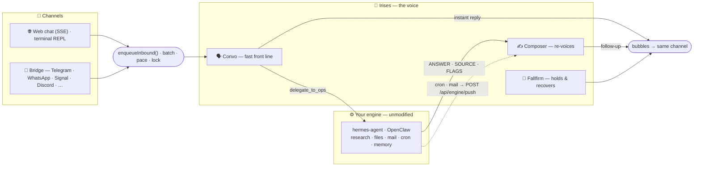

<div align="center">


# Irises

**A warm, do-anything assistant you text like a person.**

Irises is the **voice and the nerves** of an assistant — a fast front-line agent that replies in the
moment, texts like a human, and hands the hard work to a **deep-work engine you already run**
(hermes-agent or OpenClaw), then re-voices the result in its own words. To you, there's only ever Irises.

<br/>

[](LICENSE)
[](https://www.typescriptlang.org/)
[](https://nodejs.org/)
[](https://nextjs.org/)
[](https://www.anthropic.com/)
[](#-contributing)

<sub>

[Highlights](#-highlights) • [How it works](#-how-it-works) • [Engines](#-already-running-hermes-agent-or-openclaw) • [Quick start](#-quick-start) • [Updating](#-updating) • [Channels](#-channels) • [Configuration](#-configuration) • [Models](#-models) • [API](#-http-api) • [Deploy](#-deployment)

</sub>

</div>

---

## ✨ Highlights

- 🗣️ **A voice, not another brain** — **Convo** answers in the moment and delegates every piece of deep work through one seam; a **Composer** re-voices whatever comes back so the hand-off never shows.
- 🔩 **Sits in front of the engine you already run** — hermes-agent or OpenClaw does the research, files, mail, reminders and memory, completely unmodified (reminders need the hermes engine in v1 — the OpenClaw cron wiring is still pending). One command wires it up.
- 💬 **One voice, many channels** — a **web debug chat**, a **terminal REPL** (`npm run chat`), and — in bridge mode — **every channel your engine already speaks** (Telegram, WhatsApp, Signal, Discord, Slack, LINE, …).
- 🔌 **Provider-neutral LLM layer** — a single `callLLM` over Anthropic and OpenRouter, either one primary per role, with automatic fallback to the other lane on transient errors. Tool-calls, structured "bubble" output, and prompt caching normalized to one shape.
- 🕰️ **Human texting feel** — burst-batching, a per-chat send lock, and simulated-typing pacing so replies land like a person typing, not a firehose.
- 🧵 **Layered memory** — short / medium / long tiers held locally, with durable facts forwarded to the engine's own memory so both halves remember the same person.
- 📥 **Proactive, not needy** — the engine's cron jobs and mail triage push back through `POST /api/engine/push`, get voiced by the **Composer** (which opens with why the text is arriving, and falls back to **Fallfirm** if that call fails), and land on whatever channel the chat came from. Duplicate pushes are collapsed, and a non-urgent one that arrives overnight waits for morning.
- 🔍 **Fully observable** — `/debug` prompt traces and a `/dashboard` orchestration GUI show every hop, cost, and error.

## 🧠 How it works



<table>
<tr><td width="50%" valign="top">

**Agents** · `src/agents`<br/>
`convo` (front line) · `ops` (the engine seam) · `composer` (re-voices results) · `fallfirm`
(holding beats and failure recovery) — each with a persona in its `Context.md`.

**The engine seam** · `src/agents/ops`<br/>
`OPS_BACKEND` picks `hermes` (OpenAI-compatible API + cron REST) or `openclaw` (gateway
WebSocket). Unset means deep work is honestly offline — Convo still chats.
→ [docs/ENGINES.md](docs/ENGINES.md)

**Channels** · `src/channels`<br/>
One `Channel` abstraction with `web` (SSE + CLI) and `bridge` adapters.
→ [docs/CHANNELS.md](docs/CHANNELS.md)

</td><td width="50%" valign="top">

**LLM layer** · `src/llm`<br/>
One `callLLM` entry point. Per-role primary provider with the other lane as an automatic
transient-error fallback, plus structured output, tool-calls, caching, and token budget guards.

**State & memory** · `src/state`, `src/memory`<br/>
Burst-batching, per-chat send lock, simulated-typing pacing, and short/medium/long memory tiers.

**Data** · `src/db`<br/>
Local Hermes/OpenClaw-style store under `IRISES_HOME` (default `~/.irises`): SQLite
(builtin `node:sqlite`) for machine data + per-user markdown for the curated memory
tiers. `DATA_BACKEND=memory` = the same code, ephemeral (nothing persists).

**Diagnostics** · `src/diagnostics`<br/>
`/debug` prompt traces and a `/dashboard` GUI with cost, error, and memory views.

</td></tr>
</table>

## 🔩 Already running hermes-agent or OpenClaw?

Irises is built to sit **in front of the engine you already have** — and it can appear on **every
channel your engine already speaks**. Your hermes or OpenClaw does all the deep work and keeps
owning every bot and number, completely unmodified: a tiny bridge plugin — installed through the
engine's own plugin system — hands chosen chats to Irises's voice and leaves the rest alone. One
command wires it up:

```bash
# hermes users — let your own agent set it up:
hermes skills install https://raw.githubusercontent.com/rivianpratama/irises/main/skills/irises-setup-hermes/SKILL.md

# OpenClaw users:
openclaw skills install git:rivianpratama/irises

# anyone, manually:
git clone https://github.com/rivianpratama/irises && cd irises && bash scripts/engine-setup.sh --engine hermes
```

Fronting is **opt-in per chat**: the engine-side `IRISES_FRONT` glob list (matched against
`<platform>:<chat_id>`, empty by default) decides which conversations Irises answers. Everything else
the engine keeps handling itself, and blanking `IRISES_FRONT` turns the plugin inert instantly. If the
hook errors, the default `IRISES_BRIDGE_FAIL=open` lets the engine answer rather than go silent.

> **v1 gap:** scheduling reminders through Irises requires the **hermes** engine (it uses hermes's
> cron REST API). On OpenClaw everything else works, but reminder creation fails honestly until the
> gateway's cron wiring lands.

Full guide, diagrams, and security notes: **[docs/ENGINES.md](docs/ENGINES.md)**.

## 🚀 Quick start

Irises is meant to sit **on top of the engine you already run**, so the default way to install it is
to **let that engine set it up** — no npm, no config files. Ask your hermes or OpenClaw, and it clones
Irises, wires it in, and starts it from one command in its own CLI:

```bash
# hermes — let your own agent install + set it up:
hermes skills install https://raw.githubusercontent.com/rivianpratama/irises/main/skills/irises-setup-hermes/SKILL.md
#   then, in any hermes chat:  /irises-setup-hermes

# OpenClaw:
openclaw skills install git:rivianpratama/irises
#   then ask OpenClaw to run the  irises-setup-openclaw  skill
```

That's the whole setup. On boot Irises **auto-detects your engine** (`OPS_BACKEND` is set for you),
**reuses the engine's API key**, and makes its own voice **inherit the engine's model** — so *the model
Irises speaks with is the model your engine uses*. **There is no `.env` to write** (you still can — see
[Configuration](#-configuration) — anything you set wins). Full guide, bridge mode, and security notes:
**[docs/ENGINES.md](docs/ENGINES.md)**.

> **Prerequisites:** Node 22.13+ (the local store uses the builtin `node:sqlite`). No database, and —
> when you install onto an engine — no keys or config of your own: Irises reuses what the engine
> already has.

<details>
<summary><b>Prefer to wire it up by hand? (still on top of your engine)</b></summary>

<br/>

```bash
git clone https://github.com/rivianpratama/irises && cd irises
bash scripts/engine-setup.sh --engine hermes     # or: --engine openclaw
```

The script is idempotent and prints every change before making it: it enables the engine's API
surface if needed, generates the push token, and derives everything else at boot. See
[docs/ENGINES.md](docs/ENGINES.md).

</details>

<details>
<summary><b>🐛 Debug: run standalone, with no engine at all</b></summary>

<br/>

This is the **debug path** — Irises with no deep-work engine behind it. Convo still chats, but every
research/email/files/reminders request answers honestly that its deep half is offline. Use it to hack
on the persona and pipeline without an engine running.

```bash
# 1. install both packages (server + web client)
npm install && npm run install:web

# 2. add at least one LLM key (no engine to borrow one from here)
cp .env.example .env
#   set ANTHROPIC_API_KEY and/or OPENROUTER_API_KEY (leave OPS_BACKEND unset)

# 3. run the brain  →  http://localhost:3000
npm run dev

# 4. talk to Irises — in the browser (npm run dev:web) or a second terminal:
npm run chat
```

</details>

<details>
<summary><b>Build & run scripts</b></summary>

<br/>

| Script | What it does |
|--------|--------------|
| `npm run dev` | Server in watch mode (`tsx`) on `:3000` |
| `npm run dev:web` | Web debug client (Next dev server) |
| `npm run chat` | Terminal REPL onto the same web-chat endpoints (`/cancel`, `/quit`) |
| `npm run build` | `tsc` → `dist/`, then copy each agent's `Context.md` + bundled `*.txt` |
| `npm run copy:context` | The persona/asset copy step on its own |
| `npm run build:web` | Static web client → `web/out/` (served by the server at `/` in prod) |
| `npm start` | Run the built server (`node dist/index.js`) |
| `npm test` | Unit tests for `src/` and `scripts/` (Node test runner via `tsx --test`, TZ pinned to UTC, ephemeral `DATA_BACKEND=memory`) |
| `npm run install:web` | Install the web client's dependencies |

> The build **must** copy the persona files — the loader fails fast on the first turn that needs a
> missing `Context.md` rather than serving a persona-less agent.

`npm run chat` also takes `-- --url http://host:8080 --token <DEBUG_TOKEN> --client-id mylane` for
pointing at a remote instance.

</details>

## 🔄 Updating

**Just tell Irises in chat: "update yourself."** It pulls the latest code, rebuilds, restarts itself,
and confirms when it's back — no terminal needed. If there's nothing new (or something can't apply) it
says so. This is single-user by design; if you use bridge mode to front *other people's* chats, set
`UPDATE_SELF_ENABLED=false` so a fronted contact can't trigger a rebuild.

Prefer the terminal? A git-clone install also updates with one command from the clone:

```bash
bash scripts/update.sh
```

It fast-forwards `git pull`s, reinstalls deps and rebuilds (`npm ci && npm run build`, plus the web
client when it's installed), refreshes the engine bridge plugin **only if `bridge/` changed** (and
reminds you to restart the gateway), and writes an update receipt. Then **restart the server** to run
the new build. It's safe by design: fast-forward only (never auto-merges divergent local commits),
refuses a dirty working tree, and never touches your data under `$IRISES_HOME`.

Flags: `--check` (report only — exit `10` if an update is available, `0` if not), `--yes` (skip the
prompt), `--restart` (also stop + relaunch via the pidfile), `--no-restart`.

**Irises notices on its own, too.** The running server periodically checks the remote for a newer
build and surfaces it — on `/health` (`version` + `update` fields), on the `/dashboard` overview
card, and in chat: it mentions the waiting upgrade once to recently-active chats, woven naturally
into the conversation, and voices a brief "got my upgrades" after you apply it and restart. Tune or
silence this with the `UPDATE_*` env vars (see [Configuration](#-configuration)); set
`UPDATE_ANNOUNCE_ENABLED=false` to keep it quiet, `UPDATE_CHECK_ENABLED=false` to stop checking.

Docker/VM installs update by rebuilding the image instead — see [docs/DEPLOY.md](docs/DEPLOY.md) § 5.

## 📡 Channels

| Channel | How to reach Irises | Enable |
|---------|-------------------|--------|
| 🌐 **Web (debug)** | Browser chat over SSE (`web/`, served at `/`) or `npm run chat` in a terminal | On by default (`WEB_ENABLED`); gated by `DEBUG_TOKEN` like `/debug` |
| 🌉 **Bridge** | Chats your engine already owns (Telegram, WhatsApp, Signal, Discord, …) → `POST /api/bridge/inbound` | Set `OPS_BACKEND`, install the bridge plugin, list chats in `IRISES_FRONT` |

Outbound routes by `chatId` prefix — `web:` → web / CLI, `eng:<platform>:<chat>` → bridge, anything
else is **unroutable and throws** — so async follow-ups and engine-driven reminders always return on
the channel they came from, even across a restart. See **[docs/CHANNELS.md](docs/CHANNELS.md)** for
the routing model and a guide to adding your own.

## ⚙️ Configuration

**On top of an engine you normally set none of this** — Irises auto-detects the backend, reuses the
engine's key, and inherits its model (see [Models](#-models)). Everything here is optional override.
Config is environment variables, layered lowest → highest: `deploy/app.env` (committed, non-secret
baseline) loads first, then **engine auto-discovery** fills in / updates what it can from your engine,
then your local `.env` layers on top and wins over both. The knobs you're most likely to touch:

| Variable | Purpose |
|----------|---------|
| `ANTHROPIC_API_KEY` · `OPENROUTER_API_KEY` | The two LLM lanes — auto-reused from the engine when present; set to override |
| `OPS_BACKEND` | `hermes` or `openclaw` — **auto-detected**; set to force one. Unset + no engine found = deep work offline (Convo still chats) |
| `HERMES_BASE_URL` · `HERMES_API_KEY` | hermes-agent's OpenAI-compatible API server + cron REST |
| `OPENCLAW_URL` · `OPENCLAW_TOKEN` | OpenClaw gateway WebSocket |
| `ENGINE_PUSH_TOKEN` | One secret guarding both engine-facing routes (push + bridge inbound) |
| `IRISES_HOME` · `DATA_BACKEND` | State dir (default `~/.irises`) · `memory` = ephemeral run |
| `WEB_ENABLED` · `DEBUG_TOKEN` | Web debug chat (browser + `npm run chat` CLI) + its access gate |

<details>
<summary><b>Full configuration reference</b></summary>

<br/>

**Engine (the deep half)** — see [docs/ENGINES.md](docs/ENGINES.md)

| Variable | Purpose |
|----------|---------|
| `OPS_BACKEND` | `hermes` \| `openclaw`; **auto-detected at boot** from the installed engine — set to force one. Unset + none found = deep work offline, no local fallback. |
| `ENGINE_MODEL_INHERIT` | `off` to stop Irises's voice roles inheriting the engine's model and keep its own shipped models (default: on). |
| `HERMES_BASE_URL` · `HERMES_API_KEY` | hermes API server (default `http://127.0.0.1:8642`) and its `API_SERVER_KEY` (auto-derived from `~/.hermes/.env` when unset). |
| `OPENCLAW_URL` · `OPENCLAW_TOKEN` · `OPENCLAW_AGENT_ID` | Gateway WS (default `ws://127.0.0.1:18789`), auth token, agent (default `main`). |
| `ENGINE_PUSH_TOKEN` | Shared secret for `POST /api/engine/push` (`x-engine-token`) **and** `POST /api/bridge/inbound` (`x-bridge-token`). Unset = loopback-only. |
| `ENGINE_TIMEOUT_MS` · `ENGINE_MAX_CONCURRENT` | Per-call budget (default `OPS_TASK_TIMEOUT_MS − 15s`) and the engine-call semaphore (default 2). |
| `HERMES_BRIDGE_URL` · `IRISES_PUSH_URL` | Where Irises sends bridge replies (default `http://127.0.0.1:8655`) and the push URL embedded in engine cron jobs. |

**Channels**

| Variable | Purpose |
|----------|---------|
| `WEB_ENABLED` · `WEB_DEBUG_HANDLE` · `WEB_DEBUG_CHAT_ID` | Web channel toggle + its synthetic single-user identity (browser chat and the `npm run chat` CLI). |

**Data, access, and behavior**

| Variable | Purpose |
|----------|---------|
| `IRISES_HOME` · `DATA_BACKEND` | Where the local store lives (SQLite + memory markdown); `memory` = ephemeral. |
| `DEBUG_TOKEN` | Gates `/debug` **and** the web chat endpoints (unset = localhost-only). |
| `DASHBOARD_PASSWORD` | Gates `/dashboard`. **Has a built-in default — set your own before exposing the port.** |
| `PORT` · `NODE_ENV` | Listen port (3000 dev, 8080 in the image) and persona caching mode. |
| `<ROLE>_PROVIDER` · `<ROLE>_MODEL` · `<ROLE>_MODEL_OPENROUTER` · `<ROLE>_MAX_TOKENS` · `<ROLE>_EFFORT` · `<ROLE>_THINKING` | Per-role model routing and reasoning knobs (see below). |
| `OPS_TASK_TIMEOUT_MS` · `OPS_RETRY_ENABLED` · `OPS_PROGRESS_*` · `OPS_MAX_PROGRESS_PINGS` | Delegation deadline (4 min), the single cheap retry, and the "still on it" ping throttle. |
| `ROUTING_GATE` | `off` disables the grounding screen that forces data questions through the engine. |
| `BATCH_SETTLE_MS` · `TYPING_CPM` · `TYPING_DELAY_MAX_MS` | Batching + simulated-typing pacing. |
| `LLM_DAILY_TOKEN_CAP` · `OPS_TASK_TOKEN_BUDGET` · `LLM_MAX_INPUT_TOKENS_EST` | Cost circuit breakers (tripping fails loud, never re-billed on the other lane). |
| `DIAGNOSTICS_ENABLED` · `DIAGNOSTICS_*` | `/debug` trace buffer sizing and retention. |

`.env.example` is the annotated local template; `deploy/app.env` carries the shared baseline.

</details>

## 🤖 Models

**By default, Irises speaks with your engine's model.** Deep work already runs on the engine; on top
of that, at boot Irises reads the model your hermes/OpenClaw is configured with and uses it for its own
three voice roles too — so there's *one* model, not two. Both engines express their model as a
`provider/model` slug, which Irises's OpenRouter lane consumes verbatim (an exact match), reusing the
engine's key. Nothing to configure.

Override any role independently whenever you want (say, a cheaper/faster voice): set `<ROLE>_MODEL` /
`<ROLE>_MODEL_OPENROUTER` / `<ROLE>_PROVIDER` — anything you set wins over what's inherited. To stop
inheriting and keep Irises's own shipped models instead, set `ENGINE_MODEL_INHERIT=off`.

With **no engine** (the debug/standalone path) Irises falls back to its own shipped models — three
roles, OpenRouter-primary with an Anthropic fallback lane:

| Role | Standalone default | Anthropic fallback |
|------|-----------------|--------------------|
| **Convo** — front line (and the Composer re-voice) | `openai/gpt-5.6-luna:nitro` | `claude-sonnet-5` |
| **Classify** — routing, preference screens, failure triage | `openai/gpt-5.6-luna:nitro` | `claude-sonnet-4-6` |
| **Fallfirm** — holding beats + recovery voice | `openai/gpt-5.6-luna:nitro` | `claude-sonnet-4-6` |
| **Transcribe** — voice memos *(never inherited — needs an audio model)* | `google/gemini-3.5-flash-lite:nitro` | *(OpenRouter only)* |

`<ROLE>_PROVIDER` picks the primary lane per role; the other becomes the automatic fallback on 5xx /
429 / network errors.

## 🔌 HTTP API

| Method & path | Purpose | Auth |
|---------------|---------|------|
| `POST /api/web/message` · `GET /api/web/stream` · `POST /api/web/cancel` | Web debug chat (browser + `npm run chat` CLI) — send / SSE stream / stop research | `DEBUG_TOKEN` (unset = localhost) |
| `POST /api/engine/push` | Engine cron / mail → a voiced message on the right channel | `x-engine-token` |
| `POST /api/bridge/inbound` | Bridge plugin forwards a fronted chat *(mounted when `OPS_BACKEND` is set)* | `x-bridge-token` |
| `GET /debug` | Prompt diagnostics | `DEBUG_TOKEN` |
| `GET /dashboard` | Admin orchestration GUI | `DASHBOARD_PASSWORD` |
| `GET /health` | Health check + running-persona fingerprint | none |

## 🗂️ Project layout

```text
irises/
├─ src/                    # the server brain (Express · TypeScript · Node 22)
│  ├─ index.ts             #   HTTP entry, batching/mouth, boot
│  ├─ agents/              #   convo · ops (engine seam) · composer · fallfirm + orchestrator
│  ├─ channels/            #   Channel abstraction + web (SSE + CLI) · bridge
│  ├─ llm/                 #   callLLM: provider-neutral LLM layer (Anthropic + OpenRouter)
│  ├─ state/ · memory/     #   send lock, batching, pacing · short/medium/long memory tiers
│  ├─ db/ · pipeline/      #   local data layer (SQLite + memory files) · bubble, cron, time helpers
│  ├─ webhook/             #   engine push door
│  └─ diagnostics/         #   /debug traces + /dashboard GUI
├─ bridge/                 # engine plugins — hermes (Python) · openclaw (TypeScript)
├─ skills/                 # irises-setup-hermes · irises-setup-openclaw (engine-native installers)
├─ scripts/                # engine-setup.sh · update.sh · irises-chat.ts (REPL)
├─ deploy/                 # docker-compose · Caddyfile · app.env · env.vm.example
├─ docs/                   # ENGINES.md · CHANNELS.md · DEPLOY.md · PROMPTING_CHARTER.md
└─ web/                    # web debug client (Next.js, thin SSE client) — its own package
```

The server (root) and the web client (`web/`) are **two independent npm packages**.

## ☁️ Deployment

Irises ships as a single Docker image (server `dist/` **and** the static web client `web/out/`, served
together at `/`) running on any small VM with Docker behind **Caddy** for automatic HTTPS. Secrets and
per-VM values (`IMAGE`, `SITE_ADDRESS`, API keys) live in `/opt/irises/.env`, layered *under* the
committed `deploy/app.env` — which sets `PORT=8080` and wins on any overlapping key.

Deploys are **manual** — build the image, push it to a registry the VM can pull from (or `docker save`
/ `docker load` it across), and `docker compose up` on the VM.

📖 Full runbook: **[docs/DEPLOY.md](docs/DEPLOY.md)**

## ✅ Verification

```bash
npm run build                    # tsc + persona/asset copy
npm test                         # server unit tests
npm run build:web                # static web client
npm --prefix web run typecheck   # web type safety
```

The web package also carries its own suites: `npm --prefix web run test` (Vitest) and
`npm --prefix web run test:e2e` (Playwright, which builds and serves the app on `:4173`).

## 🤝 Contributing

Issues and PRs are welcome. Before opening a PR, please run the [verification](#-verification) commands
and keep the machinery that makes Irises feel like one person (the JSON bubble envelope, the
delegation seam, and the grounding rules) intact — see
[docs/PROMPTING_CHARTER.md](docs/PROMPTING_CHARTER.md) for the principles behind the prompts, bearing
in mind it's an inherited document that predates the engine split.

## 📄 License

Released under the [MIT License](LICENSE).

<div align="center"><sub>Built with 🧠 and a lot of small text bubbles.</sub></div>
