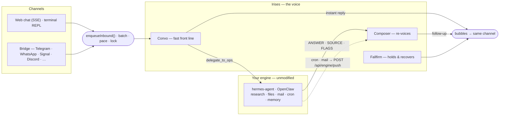

<div align="center">


# Irises

**A warm companion you text like a person. The heavy work goes to the engine you already run.**

<br/>

[](LICENSE)
[](https://www.typescriptlang.org/)
[](https://nodejs.org/)
[](https://nextjs.org/)
[](https://www.anthropic.com/)
[](#contributing)

<sub>

[Why I built this](#why-i-built-this) • [How it works](#how-it-works) • [Engines](#already-running-hermes-agent-or-openclaw) • [Quick start](#quick-start) • [Updating](#updating) • [Channels](#channels) • [Configuration](#configuration) • [Models](#models) • [API](#http-api) • [Deploy](#deployment)

</sub>

</div>

---

## Why I built this

I got tired of choosing between two kinds of assistant. The fast ones answer like a search box — instant, but shallow, and they forget you the moment you close the tab. The deep ones (hermes-agent, OpenClaw) are honestly amazing at real work, but talking to them feels like reading a report. Nobody texts like that.

So I split the problem in two.

**Irises is the voice.** It replies in the moment, texts like a human — short bubbles, a small typing pause, sometimes a "give me a sec" — and when you ask for something heavy (research, files, mail, a reminder), it quietly hands the job to the deep-work engine you already have installed, then tells you the result in its own words. You never see the seam. To you, there is only Irises.

The engine stays completely unmodified. One command wires it up. That's the whole idea.

## What makes it feel different

- **A voice, not another brain.** The front-line agent (**Convo**) answers right away and delegates every piece of deep work through one seam. A **Composer** re-voices whatever comes back, so the hand-off never shows.
- **It sits in front of what you already run.** hermes-agent or OpenClaw does the research, files, mail, reminders and memory, untouched. (Reminders need the hermes engine in v1 — the OpenClaw cron wiring is still pending.)
- **You can still reach a run that's in flight.** On hermes, every delegated leg is a real run (`POST /v1/runs` + its event stream), so "stop" actually stops the engine too, and "also check Jakarta" typed forty seconds into a two-minute look is folded into the running job instead of starting a second one. A run a restart killed is owned up to once, plainly, rather than left as a "give me a minute" that never lands. See [docs/ENGINES.md § Run control](docs/ENGINES.md#run-control).
- **She asks before the engine does something she can't take back.** A delegation that would *act* in the world — send, delete, book, post — is parked with a plain question instead of kicked off. Only a clear yes in that chat starts it, "forget it" drops it, and the engine gets one line saying it may act, for that one action. `OPS_APPROVAL_GATE=off` restores the old fire-and-forget.
- **One voice, many channels.** A web debug chat, a terminal REPL (`npm run chat`), and — in bridge mode — every channel your engine already speaks: Telegram, WhatsApp, Signal, Discord, Slack, LINE, and so on.
- **It texts like a person.** Messages get batched into bursts, each chat has a send lock, and replies are paced like real typing. No firehose of ten bubbles in one second.
- **It remembers you, in layers.** Short, medium and long memory tiers are kept locally, and the durable facts get forwarded to the engine's own memory too, so both halves remember the same person. Saved notes are quietly groomed — restate a fact three times and it folds back into one note instead of crowding out three others. Optional **semantic recall** (`MEMORY_SEMANTIC_RECALL=on`) adds an embedding leg to the archive search, so "the vacation house by the water" finds what was written down as "my lake cabin"; keyless installs get the same paraphrase tolerance from a tiny query-expansion call instead. The full design (and how it compares to vector/graph/episodic memory) is in [docs/MEMORY_ARCHITECTURES.md](docs/MEMORY_ARCHITECTURES.md).
- **It notices what recurs.** A threading inventory tracks the themes you keep circling back to — values, tensions, goals, the phrases you two have coined — and the things you left hanging, so a callback is earned instead of guessed. It's harvested from the status envelope she already emits, so it costs zero extra LLM calls. On a longer clock, a **relationship climate** (ease, candor, playfulness) drifts over weeks inside code-owned clamps and colours her voice as numberless prose, never numbers.
- **She makes the first move.** Once, minutes after install, Irises asks the engine what it already knows about its user, seeds her own memory with it (stamped second-hand), and introduces herself — *"Irises, but you can call me Iris"*. She texts first only where the engine confirms you've genuinely talked in that exact chat before; anything less and she folds the introduction into her reply to your first message instead. No cold text ever leaves the box. `FIRST_MOVE_ENABLED=false` makes the install silent.
- **It reaches out first, but politely.** The engine's cron jobs and mail triage push back through `POST /api/engine/push`, get voiced by the Composer (which opens with *why* the text is arriving), and land on whatever channel the chat came from. Duplicates are collapsed, and a non-urgent push that arrives overnight waits for morning. If you opt in (`THREADING_PINGS_ENABLED`, off by default because it makes a phone buzz unprompted), she may also text once about something you left hanging — hard-bounded to one ping per person per week, only after 48h of silence, never twice about the same thing. This part I'm quite proud of.
- **A hidden mood.** There is a small affect engine behind the scenes — a per-chat mood based on the Gloria Willcox feeling wheel, a 28-day cycle, a circadian rhythm. Nobody is told about it, and its status output is swallowed before you see it. It only makes the voice feel a bit more alive.
- **Provider-neutral LLM layer.** One `callLLM` over Anthropic, OpenRouter, and any OpenAI-compatible API — a primary lane per role, automatic fallback to the next configured lane on transient errors, and tool-calls, structured "bubble" output and prompt caching normalized to one shape.
- **Nothing is a black box.** `/debug` shows every prompt trace, and `/dashboard` shows every hop, cost, and error — plus an **Inner state** tab that reads back the hidden mood trail, the climate dials, the thread inventory, the actions still waiting on a yes, and what each turn's prompt actually looked like.

## How it works



A quick map of the code, if you want to read along:

- **Agents** (`src/agents`) — `convo` (front line), `ops` (the engine seam), `composer` (re-voices results), `fallfirm` (holding beats and failure recovery). Each one carries a persona in its `Context.md`.
- **The engine seam** (`src/agents/ops`) — `OPS_BACKEND` picks `hermes` (OpenAI-compatible API + cron REST) or `openclaw` (gateway WebSocket). Unset means deep work is honestly offline — Convo still chats. See [docs/ENGINES.md](docs/ENGINES.md).
- **Channels** (`src/channels`) — one `Channel` abstraction with `web` (SSE + CLI) and `bridge` adapters. See [docs/CHANNELS.md](docs/CHANNELS.md).
- **LLM layer** (`src/llm`) — one `callLLM` entry point, per-role primary provider, automatic fallback lane, token budget guards.
- **Persona & affect** (`src/persona`) — the hidden per-turn affect engine, the relationship climate, and the conversational-thread selection described above.
- **State & memory** (`src/state`, `src/memory`) — burst-batching, per-chat send lock, typing pacing, a durable registry of in-flight engine runs (so a restart can find and own up to the one it killed), the short/medium/long memory tiers, plus the thread harvest, the note groomer, and the optional semantic-recall leg.
- **Data** (`src/db`) — a local store under `IRISES_HOME` (default `~/.irises`): SQLite (builtin `node:sqlite`) for machine data, plus per-user markdown for the curated memory tiers. `DATA_BACKEND=memory` runs the same code but ephemeral, nothing persists.
- **Diagnostics** (`src/diagnostics`) — `/debug` prompt traces and the `/dashboard` GUI with cost, error, memory and inner-state views.

## Already running hermes-agent or OpenClaw?

Then you are the person I built this for. Irises sits **in front of the engine you already have**, and it can appear on **every channel your engine already speaks**. Your hermes or OpenClaw keeps doing all the deep work and keeps owning every bot and number — a tiny bridge plugin, installed through the engine's own plugin system, hands the chats you choose to Irises's voice and leaves the rest alone. One command wires it up:

```bash
# hermes users — let your own agent set it up:
hermes skills install https://raw.githubusercontent.com/rivianpratama/irises/main/skills/irises-setup-hermes/SKILL.md

# OpenClaw users:
openclaw skills install git:rivianpratama/irises

# anyone, manually:
git clone https://github.com/rivianpratama/irises && cd irises && bash ./scripts/engine-setup.sh --engine hermes
```

The setup now defaults to **bridge mode**: it installs the plugin, writes `IRISES_FRONT=*:*` so Irises fronts every chat out of the box, and restarts the engine gateway for you (pass `--no-bridge` to skip all of that). To front only some conversations, narrow the engine-side `IRISES_FRONT` glob list (matched against `<platform>:<chat_id>`) — everything not matched the engine keeps handling itself, and blanking `IRISES_FRONT` turns the plugin inert instantly. If the hook errors, the default `IRISES_BRIDGE_FAIL=open` lets the engine answer rather than go silent — I'd rather you get a boring reply than no reply.

On OpenClaw, Irises also teaches the engine its **engine-mode discipline automatically, once, at boot** — one chat message the agent saves to its own instructions. Nothing for you to run by hand.

> **v1 gap:** scheduling reminders through Irises requires the **hermes** engine (it uses hermes's cron REST API). On OpenClaw the reminder tools are not offered at all — so Irises never promises a reminder that can't fire — while everything else runs full-reach there: real code, the engine's own skills, parallel subagents, artifacts.

Full guide, diagrams, and security notes: **[docs/ENGINES.md](docs/ENGINES.md)**.

## Quick start

Since Irises is meant to sit on top of the engine you already run, the default install is simply to **let that engine set it up** — no npm, no config files. Ask your hermes or OpenClaw, and it clones Irises, wires it in, and starts it from one command in its own CLI — and leaves it running at `http://127.0.0.1:3000`:

```bash
# hermes — let your own agent install + set it up:
hermes skills install https://raw.githubusercontent.com/rivianpratama/irises/main/skills/irises-setup-hermes/SKILL.md
#   then, in any hermes chat:  /irises-setup-hermes

# OpenClaw:
openclaw skills install git:rivianpratama/irises
#   then ask OpenClaw to run the  irises-setup-openclaw  skill
```

That is honestly the whole setup. On boot Irises **auto-detects your engine** (`OPS_BACKEND` is set for you), **reuses the engine's API key**, and makes its own voice **inherit the engine's model** — so the model Irises speaks with is the model your engine uses. **There is no `.env` to write.** (You still can — see [Configuration](#configuration) — anything you set wins.) A few minutes later Irises makes her [first move](docs/ENGINES.md#first-move-install-introduction) — she pulls what your engine already remembers about you and, where the engine confirms you've really talked there before, sends a short hello; otherwise she simply waits for your first message. Full guide, bridge mode, and security notes: **[docs/ENGINES.md](docs/ENGINES.md)**.

> **Prerequisites:** Node 22.13+ (the local store uses the builtin `node:sqlite`). No database, and — when you install onto an engine — no keys or config of your own: Irises reuses what the engine already has.

<details>
<summary><b>Prefer to wire it up by hand? (still on top of your engine)</b></summary>

<br/>

```bash
git clone https://github.com/rivianpratama/irises && cd irises
bash ./scripts/engine-setup.sh --engine hermes     # or: --engine openclaw
```

The script is idempotent and prints every change before making it: it enables the engine's API surface if needed, generates the push token, pins `PORT=3000` in your `.env` (the committed `deploy/app.env` baseline `8080` is the Docker image's port), builds the server and the web client, then starts Irises detached — surviving the shell you ran it from — and leaves it running at `http://127.0.0.1:3000` after a health and engine round-trip check. Everything else is derived at boot. Add `--yes` for a fully non-interactive run, `--bridge` / `--no-bridge` to choose bridge mode outright. See [docs/ENGINES.md](docs/ENGINES.md).

</details>

<details>
<summary><b>Debug: run standalone, with no engine at all</b></summary>

<br/>

This is the **debug path** — Irises with no deep-work engine behind it. Convo still chats, but every research/email/files/reminders request answers honestly that its deep half is offline. I use this to hack on the persona and pipeline without an engine running.

```bash
# 1. install both packages (server + web client)
npm install && npm run install:web

# 2. add a key + force offline + pin the port
cp .env.example .env
#   set ANTHROPIC_API_KEY and/or OPENROUTER_API_KEY (no engine to borrow one from here), and set:
#     OPS_BACKEND=off      # pins debug/offline + skips engine discovery (needed if a hermes/OpenClaw
#                          # is installed on this machine, which Irises would otherwise auto-detect)
#     PORT=3000            # deploy/app.env defaults PORT to 8080 (the Caddy proxy); pin 3000 so the
#                          # server and `npm run chat` (which defaults to 3000) agree

# 3. run the brain  →  http://localhost:3000   (leave this running)
npm run dev

# 4. in a SECOND terminal, talk to Irises — browser (npm run dev:web) or the REPL:
npm run chat
#   if your server runs on another port (e.g. the 8080 default), point chat at it:
#     npm run chat -- --url http://127.0.0.1:8080
```

> One-off, without editing `.env`: `OPS_BACKEND=off PORT=3000 npm run dev`.

</details>

<details>
<summary><b>Build & run scripts</b></summary>

<br/>

| Script | What it does |
|--------|--------------|
| `npm run dev` | Server in watch mode (`tsx`) on `:3000` |
| `npm run dev:web` | Web debug client (Next dev server) |
| `npm run chat` | Terminal REPL onto the same web-chat endpoints (`/cancel`, `/quit`) |
| `npm run build` | `tsc` → `dist/`, then copy each agent's `Context.md` + bundled `*.txt` |
| `npm run copy:context` | The persona/asset copy step on its own |
| `npm run build:web` | Static web client → `web/out/` (served by the server at `/` in prod) |
| `npm start` | Run the built server (`node dist/index.js`) |
| `npm test` | Unit tests for `src/` and `scripts/` (Node test runner via `tsx --test`, TZ pinned to UTC, ephemeral `DATA_BACKEND=memory`) |
| `npm run install:web` | Install the web client's dependencies |

> The build **must** copy the persona files — the loader fails fast on the first turn that needs a missing `Context.md` rather than serving a persona-less agent.

`npm run chat` also takes `-- --url http://host:8080 --token <DEBUG_TOKEN> --client-id mylane` for pointing at a remote instance.

</details>

## Updating

**Just tell Irises in chat: "update yourself."** It pulls the latest code, rebuilds, restarts itself, and confirms when it's back — no terminal needed. If there is nothing new, or something can't apply, it says so. This is single-user by design; if you use bridge mode to front *other people's* chats, set `UPDATE_SELF_ENABLED=false` so a fronted contact can't trigger a rebuild.

Prefer the terminal? A git-clone install also updates with one command from the clone:

```bash
bash ./scripts/update.sh
```

It fast-forward `git pull`s, reinstalls deps and rebuilds (`npm ci && npm run build`, plus the web client when it's installed), refreshes the engine bridge plugin **only if `bridge/` changed** (and reminds you to restart the gateway), and writes an update receipt. Then **restart the server** to run the new build. It's careful by design: fast-forward only (it never auto-merges divergent local commits), refuses a dirty working tree, and never touches your data under `$IRISES_HOME`.

Flags: `--check` (report only — exit `10` if an update is available, `0` if not), `--yes` (skip the prompt), `--restart` (also stop + relaunch via the pidfile), `--no-restart`.

**Irises notices on its own, too.** The running server periodically checks the remote for a newer build and surfaces it — on `/health` (`version` + `update` fields), on the `/dashboard` overview card, and in chat: it mentions the waiting upgrade once to recently-active chats, woven naturally into the conversation, and voices a brief "got my upgrades" after you apply it and restart. Tune or silence this with the `UPDATE_*` env vars (see [Configuration](#configuration)); set `UPDATE_ANNOUNCE_ENABLED=false` to keep it quiet, `UPDATE_CHECK_ENABLED=false` to stop checking.

Docker/VM installs update by rebuilding the image instead — see [docs/DEPLOY.md](docs/DEPLOY.md) § 5.

## Channels

| Channel | How to reach Irises | Enable |
|---------|-------------------|--------|
| **Web (debug)** | Browser chat over SSE (`web/`, served at `/`) or `npm run chat` in a terminal | On by default (`WEB_ENABLED`); gated by `DEBUG_TOKEN` like `/debug` |
| **Bridge** | Chats your engine already owns (Telegram, WhatsApp, Signal, Discord, …) → `POST /api/bridge/inbound` | Set `OPS_BACKEND`, install the bridge plugin, list chats in `IRISES_FRONT` |

Outbound routes by `chatId` prefix — `web:` → web / CLI, `eng:<platform>:<chat>` → bridge, anything else is **unroutable and throws** — so async follow-ups and engine-driven reminders always return on the channel they came from, even across a restart. See **[docs/CHANNELS.md](docs/CHANNELS.md)** for the routing model and a guide to adding your own.

## Configuration

**On top of an engine you normally set none of this** — Irises auto-detects the backend, reuses the engine's key, and inherits its model (see [Models](#models)). Everything here is optional override. Config is environment variables, layered lowest → highest: `deploy/app.env` (committed, non-secret baseline) loads first, then **engine auto-discovery** fills in / updates what it can from your engine, then your local `.env` layers on top and wins over both. The knobs you're most likely to touch:

| Variable | Purpose |
|----------|---------|
| `ANTHROPIC_API_KEY` · `OPENROUTER_API_KEY` | The two LLM lanes — auto-reused from the engine when present; set to override |
| `OPS_BACKEND` | `hermes` or `openclaw` — **auto-detected**; set to force one. Unset + no engine found = deep work offline (Convo still chats) |
| `HERMES_BASE_URL` · `HERMES_API_KEY` | hermes-agent's OpenAI-compatible API server + cron REST |
| `OPENCLAW_URL` · `OPENCLAW_TOKEN` | OpenClaw gateway WebSocket |
| `ENGINE_PUSH_TOKEN` | One secret guarding both engine-facing routes (push + bridge inbound) |
| `IRISES_HOME` · `DATA_BACKEND` | State dir (default `~/.irises`) · `memory` = ephemeral run |
| `WEB_ENABLED` · `DEBUG_TOKEN` | Web debug chat (browser + `npm run chat` CLI) + its access gate |

<details>
<summary><b>Full configuration reference</b></summary>

<br/>

**Engine (the deep half)** — see [docs/ENGINES.md](docs/ENGINES.md)

| Variable | Purpose |
|----------|---------|
| `OPS_BACKEND` | `hermes` \| `openclaw`; **auto-detected at boot** from the installed engine — set to force one. Unset + none found = deep work offline, no local fallback. |
| `ENGINE_MODEL_INHERIT` | `off` to stop Irises's voice roles inheriting the engine's model and keep its own shipped models (default: on). |
| `HERMES_BASE_URL` · `HERMES_API_KEY` | hermes API server (default `http://127.0.0.1:8642`) and its `API_SERVER_KEY` (auto-derived from `~/.hermes/.env` when unset). |
| `OPENCLAW_URL` · `OPENCLAW_TOKEN` · `OPENCLAW_AGENT_ID` | Gateway WS (default `ws://127.0.0.1:18789`), auth token, agent (default `main`). |
| `HERMES_CAPABILITIES` · `OPENCLAW_CAPABILITIES` | Optional comma list from `web,inbox,files,code,media,scheduling` — what the operator declares the engine can do, so Irises never promises more. On hermes, live `/v1/toolsets` discovery overrides it; on OpenClaw it is the only source. Unset = unknown. |
| `ENGINE_ONBOARDING` | `off` disables the one-time engine-mode onboarding sent at boot (both engines). |
| `FIRST_MOVE_ENABLED` | `false` skips the one-time install introduction (engine memory pull + her first text). One-shot state lives in `$IRISES_HOME/first-move.json`, so restarts and updates never re-fire it. |
| `ENGINE_PUSH_TOKEN` | Shared secret for `POST /api/engine/push` (`x-engine-token`) **and** `POST /api/bridge/inbound` (`x-bridge-token`). Unset = loopback-only. |
| `ENGINE_TIMEOUT_MS` · `ENGINE_MAX_CONCURRENT` | Per-call budget (default `OPS_TASK_TIMEOUT_MS − 15s`) and the engine-call semaphore (default 2). |
| `HERMES_RUN_TRANSPORT` | `runs` (default) \| `chat` — which transport a hermes delegation speaks. `runs` = `POST /v1/runs` + SSE events, the one that lets stop and `steer_research` reach an in-flight leg; `chat` = the old blocking `/v1/chat/completions` body, no run control. Falls back to `chat` on its own for an image-bearing task or a hermes with no runs API. |
| `OPS_CANCEL_ENGINE_ABORT` | On give-up (user says stop, or Irises's own leg timeout) also tell the engine to stop working — hermes `POST /v1/runs/{id}/stop`, OpenClaw's abort RPC. `off` reverts to dropping the connection locally (the orphaned-run bug this exists to fix). Both engines. Default on. |
| `OPS_APPROVAL_GATE` | Park a delegation that would act in the world until the user says yes in that chat. `off` = kick it off immediately, no question, no parked row. Default on. |
| `HERMES_BRIDGE_URL` · `IRISES_PUSH_URL` | Where Irises sends bridge replies (default `http://127.0.0.1:8655`) and the push URL embedded in engine cron jobs. |

**Channels**

| Variable | Purpose |
|----------|---------|
| `WEB_ENABLED` · `WEB_DEBUG_HANDLE` · `WEB_DEBUG_CHAT_ID` | Web channel toggle + its synthetic single-user identity (browser chat and the `npm run chat` CLI). |

**Data, access, and behavior**

| Variable | Purpose |
|----------|---------|
| `IRISES_HOME` · `DATA_BACKEND` | Where the local store lives (SQLite + memory markdown); `memory` = ephemeral. |
| `IRISES_CYCLE_ANCHOR` | "Day 1" of the hidden 28-day affect cycle (ISO date, default `2026-01-01`). Never surfaced to the user; only sets the mood-baseline phase math. |
| `DEBUG_TOKEN` | Gates `/debug` **and** the web chat endpoints (unset = localhost-only). |
| `DASHBOARD_PASSWORD` | Gates `/dashboard`. **Has a built-in default — set your own before exposing the port.** |
| `PORT` · `NODE_ENV` | Listen port (3000 dev, 8080 in the image) and persona caching mode. |
| `<ROLE>_PROVIDER` · `<ROLE>_MODEL` · `<ROLE>_MODEL_OPENROUTER` · `<ROLE>_MAX_TOKENS` · `<ROLE>_EFFORT` · `<ROLE>_THINKING` | Per-role model routing and reasoning knobs (see below). |
| `OPS_TASK_TIMEOUT_MS` · `OPS_RETRY_ENABLED` · `OPS_PROGRESS_*` · `OPS_MAX_PROGRESS_PINGS` | Delegation deadline (4 min), the single cheap retry, and the "still on it" ping throttle. |
| `ROUTING_GATE` | `off` disables the grounding screen that forces data questions through the engine. |
| `CONVO_ROUTING_GATE_MEMORY_AWARE` | `off` makes that screen text-only again: it stops standing down for a data question she answered off something she already holds, and a delegation stops carrying what she holds to the engine (it rides beside the brief, in the task's own field, never inside it). Default on. |
| `REFUSAL_FLOOR` | `off` disables the screen that catches a reply falsely claiming it can't reach something the engine can, and delegates instead. |
| `MEMORY_PROVENANCE_ENABLED` | Stamp every durable fact `stated` \| `seeded` \| `inferred` so a guess is never cited as testimony. **Default off** — the one default-off switch in the focus set, because it changes what a memory file contains (the read side parses stamps either way). |
| `BATCH_SETTLE_MS` · `TYPING_CPM` · `TYPING_DELAY_MAX_MS` | Batching + simulated-typing pacing. |
| `LLM_DAILY_TOKEN_CAP` · `OPS_TASK_TOKEN_BUDGET` · `LLM_MAX_INPUT_TOKENS_EST` | Cost circuit breakers (tripping fails loud, never re-billed on the other lane). |
| `DIAGNOSTICS_ENABLED` · `DIAGNOSTICS_*` | `/debug` trace buffer sizing and retention. |

**Memory features** — see [docs/MEMORY_ARCHITECTURES.md](docs/MEMORY_ARCHITECTURES.md)

| Variable | Purpose |
|----------|---------|
| `MEMORY_SEMANTIC_RECALL` | `on` adds the embedding leg to archive recall (background backfill on the OpenRouter key, never a per-turn call). **Off by default** — off means no client is even built. |
| `EMBEDDINGS_MODEL` · `EMBEDDINGS_DIMENSIONS` · `MEMORY_EMBED_*` · `MEMORY_VECTOR_CANDIDATES` · `MEMORY_SEMANTIC_MIN_SCORE` | Semantic-recall knobs: model, vector width (changing it re-embeds the archive), backfill pacing, scan ceiling, and the cosine floor a hit must clear. |
| `MEMORY_RECALL_EXPANSION` | Paraphrase tolerance for keyless installs — one tiny classify call widens a recall query with synonyms (appended *after* the user's own words). Ignored while embeddings are active. Default on. |
| `NOTE_GROOM_ENABLED` · `NOTE_GROOM_THROTTLE_MS` | Fold near-duplicate saved notes into one (throttled, locally re-validated; retired notes stay in the archive). Default on / 6h. |
| `RELATIONSHIP_CLIMATE_ENABLED` | The weeks-scale standing register (ease / candor / playfulness), one classify eval per 22h inside code-owned clamps. `false` stops both the eval and the read immediately; the stored row survives. Default on. |
| `CONVO_THREADING_ENABLED` | The theme + open-loop inventory. Zero extra LLM calls; `false` gates both the harvest and the pre-turn read, and the stored inventory survives being turned off. Default on. |
| `THREADING_PINGS_ENABLED` | Lets her *start* a message about a loop left hanging. **Default off** (it buzzes a phone unprompted); hard bounds when on — one ping per person per week, 48h of silence first, never a group, never twice about the same thing. |
| `FIRST_MOVE_ENABLED` | The one-time install introduction described above. Default on. |

`.env.example` is the annotated local template; `deploy/app.env` carries the shared baseline.

</details>

## Models

**By default, Irises speaks on your engine's API.** Deep work already runs on the engine; on top of that, at boot Irises reads your hermes/OpenClaw's configured **provider, endpoint, and key** and points its own three voice roles at the *same API* — so the voice works whatever the engine runs on, including a non-OpenRouter, non-Anthropic ("obscure") OpenAI-compatible API (OpenAI, Azure, vLLM, deepseek-direct, Groq, a self-hosted gateway…). The chat voice keeps a **cheap, fast** model on that API (curated per provider: OpenRouter → `deepseek/deepseek-v4-flash:nitro`, OpenAI → `gpt-5.6-luna`, Anthropic → `claude-sonnet-5`; any other reachable provider → the engine's own model), so replies stay snappy while deep work uses the big engine model. A foreign auth/protocol Irises can't call directly (Bedrock, Vertex, Gemini-native, OAuth) keeps a working fallback lane and warns. Nothing to configure. *(Auto endpoint/key inheritance is implemented for hermes; an OpenClaw user on an obscure API sets it by hand — see [docs/ENGINES.md](docs/ENGINES.md#model-inheritance).)*

There are **three lanes**: `anthropic` (native SDK, honours `ANTHROPIC_BASE_URL`), `openrouter` (openrouter.ai + its proprietary extras), and `openai` (a generic OpenAI-compatible client whose endpoint is `OPENAI_BASE_URL`). Want a cheaper or faster voice, or a different endpoint? Override any role independently: `<ROLE>_MODEL` / `<ROLE>_MODEL_OPENROUTER` / `<ROLE>_MODEL_OPENAI` / `<ROLE>_PROVIDER`, plus `OPENAI_BASE_URL` / `OPENROUTER_BASE_URL` — anything you set wins over what's inherited. To stop inheriting and keep Irises's own shipped models, set `ENGINE_MODEL_INHERIT=off`. The live model map (voice vs. deep-work) shows in `/health`, the `/dashboard` overview, and `npx tsx ./scripts/print-model-map.ts` — and Irises will tell you in chat if you ask.

With **no engine** (the debug/standalone path) Irises falls back to its own shipped models — three roles, OpenRouter-primary with an Anthropic fallback lane:

| Role | Standalone default | Anthropic fallback |
|------|-----------------|--------------------|
| **Convo** — front line (and the Composer re-voice) | `openai/gpt-5.6-luna:nitro` | `claude-sonnet-5` |
| **Classify** — routing, preference screens, failure triage | `openai/gpt-5.6-luna:nitro` | `claude-sonnet-4-6` |
| **Fallfirm** — holding beats + recovery voice | `openai/gpt-5.6-luna:nitro` | `claude-sonnet-4-6` |
| **Transcribe** — voice memos *(never inherited — needs an audio model)* | `google/gemini-3.5-flash-lite:nitro` | *(OpenRouter only)* |

`<ROLE>_PROVIDER` picks the primary lane per role (`anthropic` | `openrouter` | `openai`); the first configured other lane becomes the automatic fallback on 5xx / 429 / network errors.

## HTTP API

| Method & path | Purpose | Auth |
|---------------|---------|------|
| `POST /api/web/message` · `GET /api/web/stream` · `POST /api/web/cancel` | Web debug chat (browser + `npm run chat` CLI) — send / SSE stream / stop research | `DEBUG_TOKEN` (unset = localhost) |
| `POST /api/engine/push` | Engine cron / mail → a voiced message on the right channel | `x-engine-token` |
| `POST /api/bridge/inbound` | Bridge plugin forwards a fronted chat *(mounted when `OPS_BACKEND` is set)*; idempotent per message id, so a plugin retry is answered once, never run twice | `x-bridge-token` |
| `GET /debug` | Prompt diagnostics | `DEBUG_TOKEN` |
| `GET /dashboard` | Admin orchestration GUI | `DASHBOARD_PASSWORD` |
| `GET /health` | Health check + running-persona fingerprint | none |

## Project layout

```text
irises/
├─ src/                    # the server brain (Express · TypeScript · Node 22)
│  ├─ index.ts             #   HTTP entry, batching/mouth, boot
│  ├─ agents/              #   convo · ops (engine seam: runs, stop/steer, consent gate) · composer · fallfirm + orchestrator
│  ├─ channels/            #   Channel abstraction + web (SSE + CLI) · bridge
│  ├─ llm/                 #   callLLM: provider-neutral LLM layer (Anthropic + OpenRouter + OpenAI-compatible)
│  ├─ persona/             #   hidden affect engine (mood wheel · circadian · 28-day cycle · status) · climate · threads
│  ├─ state/ · memory/     #   send lock, batching, pacing · memory tiers · thread harvest · note groomer · semantic recall
│  ├─ db/ · pipeline/      #   local data layer (SQLite + memory files · ops-run registry · bridge dedupe) · bubble, cron, time helpers
│  ├─ update/              #   self-update checker, announcer, pidfile, version stamp
│  ├─ webhook/             #   engine push door
│  └─ diagnostics/         #   /debug traces + /dashboard GUI (overview · memory · inner state)
├─ bridge/                 # engine plugins — hermes (Python) · openclaw (TypeScript) · contract-fixtures (the shared v1 payload)
├─ skills/                 # irises-setup-hermes · irises-setup-openclaw (engine-native installers)
├─ scripts/                # engine-setup.sh · update.sh · irises-chat.ts (REPL)
├─ deploy/                 # docker-compose · Caddyfile · app.env · env.vm.example
├─ docs/                   # ENGINES.md · CHANNELS.md · DEPLOY.md · MEMORY_ARCHITECTURES.md · PROMPTING_CHARTER.md
└─ web/                    # web debug client (Next.js, thin SSE client) — its own package
```

The server (root) and the web client (`web/`) are **two independent npm packages**.

## Deployment

Irises ships as a single Docker image (server `dist/` **and** the static web client `web/out/`, served together at `/`) running on any small VM with Docker behind **Caddy** for automatic HTTPS. Secrets and per-VM values (`IMAGE`, `SITE_ADDRESS`, API keys) live in `/opt/irises/.env`, layered *under* the committed `deploy/app.env` — which sets `PORT=8080` and wins on any overlapping key.

Deploys are **manual** — build the image, push it to a registry the VM can pull from (or `docker save` / `docker load` it across), and `docker compose up` on the VM.

Full runbook: **[docs/DEPLOY.md](docs/DEPLOY.md)**

## Verification

```bash
npm run build                    # tsc + persona/asset copy
npm test                         # server unit tests
npm run build:web                # static web client
npm --prefix web run typecheck   # web type safety
```

The web package also carries its own suites: `npm --prefix web run test` (Vitest) and `npm --prefix web run test:e2e` (Playwright, which builds and serves the app on `:4173`).

## Contributing

Issues and PRs are very welcome — even a small one. If you found the docs confusing somewhere, that is a bug too; please open an issue and tell me where you got lost.

Before opening a PR, please run the [verification](#verification) commands, and keep the machinery that makes Irises feel like one person intact: the JSON bubble envelope, the delegation seam, and the grounding rules. [docs/PROMPTING_CHARTER.md](docs/PROMPTING_CHARTER.md) explains the principles behind the prompts — bear in mind it's an inherited document that predates the engine split.

## License

Released under the [MIT License](LICENSE).

<div align="center"><sub>Built with care and a lot of small text bubbles.</sub></div>
