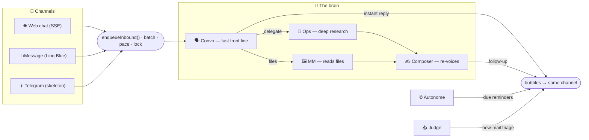

<div align="center">


# Irises

**A warm, do-anything assistant you text like a person.**

Irises is a private, server-side **multi-agent brain** reachable over the web, iMessage, and (soon) Telegram. A fast front-line agent replies instantly and quietly hands the hard stuff to a deeper research agent — then re-voices the answer in its own words. To you, there's only ever Irises.

<br/>

[](LICENSE)
[](https://www.typescriptlang.org/)
[](https://nodejs.org/)
[](https://nextjs.org/)
[](https://www.anthropic.com/)
[](#-contributing)

<sub>

[Highlights](#-highlights) • [How it works](#-how-it-works) • [Quick start](#-quick-start) • [Channels](#-channels) • [Configuration](#-configuration) • [Models](#-models) • [API](#-http-api) • [Deploy](#-deployment)

</sub>

</div>

---

## ✨ Highlights

- 🧠 **Two-tier agent design** — a fast **Convo** front line answers in the moment and delegates deep work to a powerful **Ops** researcher, which is re-voiced by a **Composer** so the seam never shows.
- 💬 **One brain, many channels** — the same assistant over a **web debug chat**, **iMessage** (Linq Blue), and a **prepared Telegram** adapter. Add a channel by implementing one interface.
- 🔌 **Provider-neutral LLM layer** — a single `callLLM` with Anthropic primary and automatic OpenRouter fallback; tool-calls, vision/PDF, web search, and prompt caching normalized to one shape.
- 🕰️ **Human texting feel** — burst-batching, a per-chat send lock, and simulated-typing pacing so replies land like a person typing, not a firehose.
- 🧵 **Living memory** — short / medium / long tiers curated by a silent **Reflexion** agent, so Irises remembers what matters and forgets the noise.
- 📥 **Proactive, not needy** — an **Autonome** sweeper fires reminders you set up, and a **Judge** triages new email into timely nudges (opt-in).
- 🔍 **Fully observable** — `/debug` prompt traces and a `/dashboard` orchestration GUI show every agent-to-agent hop.
- 🧪 **Batteries-included ops** — Docker + Caddy + GitHub Actions, an in-memory data backend for zero-infra local runs, and a green test suite.

## 🧠 How it works



<table>
<tr><td width="50%" valign="top">

**LLM layer** · `src/llm`<br/>
One `callLLM` entry point. Anthropic primary, OpenRouter fallback on transient errors. Tool-calls, vision/PDF, web search, prompt caching, and structured "bubble" output all normalized.

**Agents** · `src/agents`<br/>
`convo` · `ops` · `mm` · `composer` · `autonome` · `judge` · `fallfirm` · `reflexion` — each with a persona in its `Context.md`.

**Channels** · `src/channels`<br/>
A `Channel` abstraction over the outbound "mouth" with `linq`, `web` (SSE), and `telegram` adapters. → [docs/CHANNELS.md](docs/CHANNELS.md)

</td><td width="50%" valign="top">

**State & memory** · `src/state`, `src/memory`<br/>
Burst-batching, per-chat send lock, simulated-typing pacing, and short/medium/long memory tiers refreshed by the Reflexion curator.

**Data** · `src/db` + `supabase/migrations`<br/>
Supabase Postgres with an in-memory dev fallback (`DATA_BACKEND=memory`).

**Diagnostics** · `src/diagnostics`<br/>
`/debug` prompt traces and a `/dashboard` orchestration GUI showing the delegation graph.

</td></tr>
</table>

## 🔩 Already running hermes-agent or OpenClaw?

Irises is built to sit **in front of the engine you already have** — and it can appear on **every
channel your engine already speaks** (WhatsApp, Signal, Discord, Slack, LINE, …). Your hermes or
OpenClaw does all the deep work (research, email, files, reminders, memory) and keeps owning every
bot and number, completely unmodified: a tiny bridge plugin — installed through the engine's own
plugin system — hands chosen chats to Irises's voice and leaves the rest alone. One command wires
it up (bridge mode is opt-in per chat; a plugin-free Telegram bot handoff remains the alternative):

```bash
# hermes users — let your own agent set it up:
hermes skills install https://raw.githubusercontent.com/rivianpratama/irises/main/skills/irises-setup-hermes/SKILL.md

# OpenClaw users:
openclaw skills install git:rivianpratama/irises

# anyone, manually:
git clone https://github.com/rivianpratama/irises && cd irises && bash scripts/engine-setup.sh --engine hermes
```

Full guide, diagrams, and security notes: **[docs/ENGINES.md](docs/ENGINES.md)**.

## 🚀 Quick start

> **Prerequisites:** Node 22+, an `ANTHROPIC_API_KEY`. No database required — the in-memory backend runs infra-free.

```bash
# 1. install both packages (server + web client)
npm install && npm run install:web

# 2. configure — copy the template and add your key
cp .env.example .env
#   set DATA_BACKEND=memory and ANTHROPIC_API_KEY=sk-ant-...
#   (add OPENROUTER_API_KEY for the fallback + media/voice models)

# 3. run the brain  →  http://localhost:3000  (GET /health → { "status": "ok" })
npm run dev

# 4. in another terminal, run the web debug chat and start talking to Irises
npm run dev:web
```

That's it — **no Linq, iMessage, or Telegram setup needed** to chat with Irises locally.

<details>
<summary><b>Build & run scripts</b></summary>

<br/>

| Script | What it does |
|--------|--------------|
| `npm run dev` | Server in watch mode (`tsx`) on `:3000` |
| `npm run dev:web` | Web debug client (Next dev server) |
| `npm run build` | `tsc` → `dist/`, then copy each agent's `Context.md` + bundled `*.txt` |
| `npm run build:web` | Static web client → `web/out/` (served by the server at `/` in prod) |
| `npm start` | Run the built server (`node dist/index.js`) |
| `npm test` | Server unit tests |
| `npm run install:web` | Install the web client's dependencies |

> The build **must** copy the persona files — the loader throws at boot if a `Context.md` is missing.

</details>

## 📡 Channels

| Channel | How to reach Irises | Enable |
|---------|-------------------|--------|
| 🌐 **Web (debug)** | Browser chat streamed over SSE (`web/`), served at `/` | On by default (`WEB_ENABLED`); gated by `DEBUG_TOKEN` like `/debug` |
| 💬 **iMessage** | Linq Blue webhook → `POST /webhook` | Set `LINQ_API_TOKEN` + `LINQ_AGENT_BOT_NUMBERS` |
| ✈️ **Telegram** | `POST /webhook/telegram` *(prepared skeleton)* | `TELEGRAM_ENABLED=true` + `TELEGRAM_BOT_TOKEN` |

Outbound routes by `chatId` prefix (`web:` / `tg:` / bare = Linq), so async follow-ups and proactive
reminders always return on the channel they came from. See **[docs/CHANNELS.md](docs/CHANNELS.md)**
for the routing model and a guide to adding your own.

## ⚙️ Configuration

All server config is environment variables. `deploy/app.env` holds the committed, non-secret baseline (models, pacing, job intervals); your local `.env` layers on top with secrets. The essentials:

| Variable | Purpose |
|----------|---------|
| `ANTHROPIC_API_KEY` | Primary LLM provider (all roles) |
| `OPENROUTER_API_KEY` | Fallback provider + media/voice transcription |
| `DATA_BACKEND` | `memory` (no infra) or `supabase` |
| `WEB_ENABLED` · `DEBUG_TOKEN` | Web debug chat + its access gate |
| `LINQ_API_TOKEN` · `LINQ_AGENT_BOT_NUMBERS` | iMessage (Linq Blue) channel |
| `TELEGRAM_ENABLED` · `TELEGRAM_BOT_TOKEN` | Telegram channel (skeleton) |

<details>
<summary><b>Full configuration reference</b></summary>

<br/>

| Variable | Purpose |
|----------|---------|
| `ANTHROPIC_API_KEY` | Primary LLM provider for every role. |
| `OPENROUTER_API_KEY` | Automatic fallback + media/voice models. |
| `OPENAI_API_KEY` | Optional (legacy image/utility paths). |
| `DATA_BACKEND` | `memory` = zero-infra local; `supabase` = Postgres. |
| `SUPABASE_URL` · `SUPABASE_SERVICE_ROLE_KEY` | Postgres data layer (omit for the in-memory fallback). |
| `WEB_ENABLED` · `WEB_DEBUG_HANDLE` | Web channel toggle + its synthetic single-user identity. |
| `LINQ_API_TOKEN` · `LINQ_API_BASE_URL` · `LINQ_AGENT_BOT_NUMBERS` | iMessage (Linq Blue). |
| `TELEGRAM_ENABLED` · `TELEGRAM_BOT_TOKEN` · `TELEGRAM_WEBHOOK_SECRET` | Telegram (prepared skeleton). |
| `GOOGLE_OAUTH_CLIENT_ID` · `GOOGLE_OAUTH_CLIENT_SECRET` · `GOOGLE_OAUTH_REDIRECT_URI` | Optional per-user Gmail read-only OAuth. |
| `TOKEN_ENCRYPTION_KEY` | AES-256-GCM key encrypting Gmail refresh tokens at rest. |
| `DEBUG_TOKEN` | Gates `/debug` **and** the web chat endpoints (unset = localhost-only). |
| `DASHBOARD_PASSWORD` | Gates `/dashboard` (unset = localhost-only). |
| `AUTONOME_ENABLED` · `EMAIL_POLL_ENABLED` · `EMAIL_BACKSTOP_ENABLED` | Proactive sweeper + email triage. |
| `<ROLE>_MODEL` · `<ROLE>_PROVIDER` · `<ROLE>_MODEL_OPENROUTER` | Per-role model overrides (see below). |
| `BATCH_SETTLE_MS` · `TYPING_CPM` · `TYPING_DELAY_MAX_MS` | Batching + simulated-typing pacing. |

Per-role tuning, escalation knobs, and pacing all have sensible defaults in `deploy/app.env` — see `.env.example` for the fully annotated list.

</details>

## 🤖 Models

| Role | Default model |
|------|---------------|
| **Convo** — fast front line | `claude-sonnet-5` |
| **Ops** — deep research (+ escalation) | `claude-opus-4-8` |
| **MM** — media reader | `google/gemini-3.5-flash` *(OpenRouter)* |
| **Judge** — email triage | `claude-sonnet-4-6` |
| **Reflexion** — memory curator | `claude-opus-4-8` |
| **Composer / Autonome / Fallfirm / Classify** | Haiku-tier |

Every role has an OpenRouter fallback slug and is overridable via env.

## 🔌 HTTP API

| Method & path | Purpose |
|---------------|---------|
| `POST /api/web/message` · `GET /api/web/stream` · `POST /api/web/cancel` | Web debug chat (send / SSE stream / stop) |
| `POST /webhook` | iMessage (Linq Blue) receiver |
| `POST /webhook/telegram` | Telegram receiver *(skeleton)* |
| `POST /webhook/gmail` | Gmail Pub/Sub push → fires the Judge |
| `GET /oauth/google/callback` | Gmail OAuth redirect |
| `GET /debug` | Prompt diagnostics *(token-gated)* |
| `GET /dashboard` | Admin orchestration GUI *(password-gated)* |
| `GET /health` | Health check |

## 🗂️ Project layout

```text
irises/
├─ src/                    # the server brain (Express · TypeScript · Node 22)
│  ├─ index.ts             #   HTTP entry, batching/mouth, boot
│  ├─ agents/              #   convo · ops · mm · composer · autonome · judge · fallfirm · reflexion
│  ├─ channels/            #   Channel abstraction + linq · web (SSE) · telegram adapters
│  ├─ llm/                 #   callLLM: provider-neutral LLM layer (Anthropic + OpenRouter)
│  ├─ state/ · memory/     #   send lock, batching, pacing · short/medium/long memory tiers
│  ├─ db/ · pipeline/      #   Supabase | in-memory data layer · sweeper, email triage
│  └─ oauth/ · diagnostics/#   Gmail OAuth · /debug + /dashboard
├─ supabase/migrations/    # Postgres schema
├─ deploy/                 # docker-compose · Caddy · GCP setup / bootstrap
├─ docs/                   # DEPLOY.md · CHANNELS.md
└─ web/                    # web debug client (Next.js, thin SSE client) — its own package
```

The server (root) and the web client (`web/`) are **two independent npm packages**.

## ☁️ Deployment

Irises ships as a single Docker image (server `dist/` **and** the static web client `web/out/`, served
together at `/`) running on a GCP Compute Engine VM behind **Caddy** for automatic HTTPS, auto-deployed
on push via **GitHub Actions**. Production config lives in `/opt/irises/.env` (`PORT=8080`).

📖 Full runbook: **[docs/DEPLOY.md](docs/DEPLOY.md)**

## ✅ Verification

```bash
npm run build                    # tsc + persona/asset copy
npm test                         # server unit tests
npm run build:web                # static web client
npm --prefix web run typecheck   # web type safety
```

## 🤝 Contributing

Issues and PRs are welcome. Before opening a PR, please run the [verification](#-verification) commands
and keep the multi-agent machinery (the JSON bubble envelope, delegation seams, and grounding rules)
intact — see [docs/PROMPTING_CHARTER.md](docs/PROMPTING_CHARTER.md) for the principles behind the prompts.

## 📄 License

Released under the [MIT License](LICENSE).

<div align="center"><sub>Built with 🧠 and a lot of small text bubbles.</sub></div>
