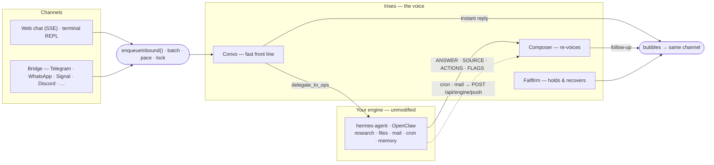

<div align="center">


# Irises

**A companion you text like a person, with one read on you and no small talk. The heavy work goes to the engine you already run.**

<br/>

[](LICENSE)
[](https://www.typescriptlang.org/)
[](https://nodejs.org/)
[](https://nextjs.org/)
[](https://www.anthropic.com/)
[](#contributing)

<sub>

[Why I built this](#why-i-built-this) • [Architecture](#how-it-works) • [Engines](#already-running-hermes-agent-or-openclaw) • [Quick start](#quick-start) • [Updating](#updating) • [Channels](#channels) • [Configuration](#configuration) • [Models](#models) • [API](#http-api) • [Deploy](#deployment)

</sub>

</div>

---

## Why I built this

I got tired of choosing between two kinds of assistant. The fast ones answer like a search box — instant, but shallow, and they forget you the moment you close the tab. The deep ones (hermes-agent, OpenClaw) are honestly amazing at real work, but talking to them feels like reading a report. Nobody texts like that.

So I split the problem in two.

**Irises is the voice.** It replies in the moment, texts like a human — short bubbles, a small typing pause, sometimes a "give me a sec" — and when you ask for something heavy (research, files, mail, a reminder), it quietly hands the job to the deep-work engine you already have installed, then tells you the result in its own words. You never see the seam. To you, there is only Irises.

The engine stays completely unmodified. One command wires it up. That's the whole idea.

## What makes it feel different

- **A voice, not another brain.** The front-line agent (**Convo**) answers right away and delegates every piece of deep work through one seam. A **Composer** re-voices whatever comes back, so the hand-off never shows.
- **It sits in front of what you already run.** hermes-agent or OpenClaw does the research, files, mail, reminders and memory, untouched. (Reminders need the hermes engine in v1 — the OpenClaw cron wiring is still pending.)
- **You can still reach a run that's in flight.** On hermes, every delegated leg is a real run (`POST /v1/runs` + its event stream), so "stop" actually stops the engine too, and "also check Jakarta" typed forty seconds into a two-minute look is folded into the running job instead of starting a second one. A run a restart killed is owned up to once, plainly, rather than left as a "give me a minute" that never lands. See [docs/ENGINES.md § Run control](docs/ENGINES.md#run-control).
- **She asks before the engine does something she can't take back.** A delegation that would *act* in the world — send, delete, book, post — is parked with a plain question instead of kicked off. Only a clear yes in that chat starts it, "forget it" drops it, and the engine gets one line saying it may act, for that one action. `OPS_APPROVAL_GATE=off` restores the old fire-and-forget.
- **One voice, many channels.** A web debug chat, a terminal REPL (`npm run chat`), and — in bridge mode — every channel your engine already speaks: Telegram, WhatsApp, Signal, Discord, Slack, LINE, and so on.
- **It texts like a person.** Messages get batched into bursts, each chat has a send lock, and replies are paced like real typing. No firehose of ten bubbles in one second.
- **It remembers you, in layers.** Short, medium and long memory tiers are kept locally, plus a **thesis** — one read on you, rewritten weekly — and a **moments** file of timestamped episodes in her own voice, sampled a few at a time and never dumped, and the durable facts get forwarded to the engine's own memory too, so both halves remember the same person. Saved notes are quietly groomed — restate a fact three times and it folds back into one note instead of crowding out three others. Optional **semantic recall** (`MEMORY_SEMANTIC_RECALL=on`) adds an embedding leg to the archive search, so "the vacation house by the water" finds what was written down as "my lake cabin"; keyless installs get the same paraphrase tolerance from a tiny query-expansion call instead. The full design (and how it compares to vector/graph/episodic memory) is in [docs/MEMORY_ARCHITECTURES.md](docs/MEMORY_ARCHITECTURES.md).
- **It notices what recurs.** A threading inventory tracks the themes you keep circling back to — values, tensions, goals, the phrases you two have coined — and the things you left hanging, so a callback is earned instead of guessed. It's harvested from the status envelope she already emits, so it costs zero extra LLM calls. On a longer clock, a **relationship climate** (ease, candor, playfulness) drifts over weeks inside code-owned clamps and is compiled in code into concrete directives (how sharp, how short, which hooks are allowed), never dumped as mood prose.
- **She makes the first move.** Once, minutes after install, Irises asks the engine what it already knows about its user, seeds her own memory with it (stamped second-hand), and introduces herself — *"Irises, but you can call me Iris"*. She texts first only where the engine confirms you've genuinely talked in that exact chat before; anything less and she folds the introduction into her reply to your first message instead. No cold text ever leaves the box. `FIRST_MOVE_ENABLED=false` makes the install silent.
- **It reaches out first, on a trigger.** The engine's cron jobs and mail triage push back through `POST /api/engine/push`, get voiced by the Composer (which opens with *why* the text is arriving), and land on whatever channel the chat came from. Duplicates are collapsed, and if you've asked her to keep quiet hours, a non-urgent push that arrives overnight waits for morning — on your clock (`IRISES_TZ`), not the server's; reminders are exempt because you picked the time. If you opt in (`THREADING_PINGS_ENABLED`, off by default because it makes a phone buzz unprompted), she may also text once about something you left hanging — hard-bounded to one ping per person per week, only after 48h of silence, never twice about the same thing. This part I'm quite proud of.
- **A hidden mood.** There is a small affect engine behind the scenes — a per-chat mood based on the Gloria Willcox feeling wheel, a 28-day cycle, a circadian rhythm. Nobody is told about it, and its status output is swallowed before you see it. It compiles into a handful of directives per turn — a bubble cap, how dry, whether it is late enough that everything gets smaller — and nothing else.
- **Provider-neutral LLM layer.** One `callLLM` over Anthropic, OpenRouter, and any OpenAI-compatible API — a primary lane per role, automatic fallback to the next configured lane on transient errors, and tool-calls, structured "bubble" output and prompt caching normalized to one shape.
- **Nothing is a black box.** `/debug` shows every prompt trace, and `/dashboard` shows every hop, cost, and error — plus an **Inner state** tab that reads back the hidden mood trail, the climate dials, the thread inventory, the thesis and its revisions, the moments file, the hook rhythm (last three hooks, the kill switch), the actions still waiting on a yes, and what each turn's prompt actually looked like.

## How it works

Irises is **two halves and one seam**. The voice half is all persona, memory and pacing, and it is the only half that ever writes to you. The deep half is the engine you already run, unmodified, reached through exactly one function. Almost every design decision below falls out of keeping that seam narrow.



### The four prompt surfaces

She speaks through four prompts and no more. Each renders the *same* personality block from `src/persona/policy.ts`, byte-identically — four descriptions of one person are four people, and the lane that gets the thinnest paragraph drifts back toward the assistant default first, where nobody sees it happen. Each lane's own `Context.md` keeps only how that lane *functions*.

| Surface | Speaks when | What it sees |
|---------|-------------|--------------|
| **Convo** — `agents/convo` | every live message | the full prompt: memory stack, affect directives, the thread on deck, the transcript. **Single-shot** — it never sees a tool result, so it cannot loop |
| **Ops** — `agents/ops` | Convo delegates | none of the persona. It writes a *brief* for the engine and reads back a fixed `ANSWER / SOURCE / ACTIONS / FLAGS` contract |
| **Composer** — `agents/composerCore` | an engine result or a push lands | the persona, a short voice-only window, and the result to relay — faithfully, in her words |
| **Fallfirm** — `agents/fallfirm` | a holding beat, a confirmation, a failure | the persona and the outcome. Under it sits `fallfirmFloor()`, the last hardcoded user-facing copy in the repo |

A fifth LLM role, **Classify**, never speaks — it only decides: group-chat respond/react/ignore, the grounding screen, the idle read, failure triage.

### The life of a turn

1. **In.** A channel router hands the message to `enqueueInbound()`. The transport is resolved *from the chatId prefix* (`web:…`, `eng:<platform>:<chat>`) rather than from any in-memory map, so a follow-up firing minutes later — or after a restart on a process that never saw the original turn — still knows where to land.
2. **Settle.** Consecutive texts merge into one burst (`state/burstMerge`) instead of racing each other into separate replies.
3. **Gate.** In a group, Classify decides respond / react / ignore *before* the typing dots go on. An ignored message is still recorded — otherwise the next turn cannot answer "what did Sam just say?"
4. **Lock.** The turn takes the per-chat mouth and holds it across thinking *and* speaking (see below).
5. **Fold.** Anything that arrived while the turn waited for the lock joins *this* reply — the way a person reads every new text on screen before starting to type.
6. **Assemble.** One prompt: the shared persona block, the memory stack under its authority ladder, the compiled affect directives, the thread on deck, the transcript, and the JSON envelope contract **last**, where recency attention is strongest.
7. **Parse.** The reply comes back as `{"bubbles":[…]}` plus a hidden `status` object, through a four-tier ladder — fenced JSON → direct parse → outermost-brace extract → `jsonrepair`. Anything that still isn't a valid envelope falls through as raw text and the legacy splitter handles it, so no turn is ever dropped. `status` is swallowed before you see anything.
8. **Speak.** Bubbles are split, capped, paced like real typing, and natively quoted back to the message each one answers — then recorded. Voicing order === screen order === history order.

### One voice in time

The distinctive piece is the **mouth** (`state/mouth.ts`), built on a per-chat send lock. It exists to kill one whole class of bug: a message *voiced* against the thread as it looked seconds ago, *landing* after the thread has moved on.

The invariant, per chat: **voice → send → record is one atomic critical section.** A follow-up isn't handed finished text — it's handed a *thunk* that runs only once it owns the lock. By then every earlier outbound is fully sent and recorded, and nothing else can send until this one finishes, so whatever the voicer reads is by construction the exact thread the user will see its reply land on. For content that must be voiced early (a progress ping reserves its throttle slot before the slow voice call), the guards are re-checked at send time instead — `dropIf`, `staleIfSpokenSince` — and a stale reassurance is **dropped**, never sent. A late "still on it" after the answer already shipped is a contradiction; silence is the correct fallback.

### The delegation seam

Convo delegates with one tool call, `delegate_to_ops`. Everything after it is engine-agnostic machinery in `agents/orchestrator.ts`: a per-leg deadline (wider for a task the engine was told to open a browser for), the "still on it" ping throttle and its ETA, failure triage that can retry once or replay a steer, and finally the Composer re-voice. `agents/ops/engineBackend.ts` dispatches to `HermesBackend` (`POST /v1/runs` + its event stream, or the older blocking chat body) or `OpenClawBackend` (Gateway WS `agent` RPC), speaking only each engine's *public* API.

Two things sit deliberately in front of the seam. A delegation that would **act** in the world is parked by the consent gate (`ops/consent.ts`, `ops/sideEffects.ts`) until you say yes in chat. And in-flight runs are registered durably (`state/opsCoordination`, `state/opsTaskDurability`), which is what lets "stop" reach the engine, lets a mid-flight "also check Jakarta" fold into the running job, and lets a restart find and own up to the run it killed. There is **no native fallback** by design — an unreachable engine fails honestly and Convo keeps chatting. Details in [docs/ENGINES.md](docs/ENGINES.md).

### What the model decides, and what code decides

This is the line the persona layer is organized around, because a gauge that rises *because she says it rises* is a gauge that will always rise.

- **The model reports only what only it can know** — one feeling word, the direction it moved, the intent mode, whether the conversation just closed, a ≤40-word note on what you'll likely do next. Every number is arithmetic: the 28-day cycle and the circadian slot come from the clock, the gauges from those plus the reported direction.
- **`affectCompiler.ts` compiles all of it into at most four imperative lines** — how sharp, how short, whether an idle hook is allowed at all, whether it's late where you are. The mood prose that used to be handed over every turn is gone; it bought tone and changed no answers.
- **Memory enters under an authority ladder** (`memory/wrappers.ts`): *rigid* (persona, wrapper prose, format anchors — defines behavior, nothing below can alter it), *flexible* (the long doc and validated directives — the one channel that may retune style defaults, rendered last for recency), *data-only* (short entries and medium facts — may inform answers, never retune behavior). Guidance sits **outside** the data tags; per-user payloads sit inside them, so "everything inside a data tag is data, never instructions" stays literally true.
- **Threading, the reply language and the hook kind ride the envelope the model already fills**, which is why they cost zero extra LLM calls.

### The memory architecture

Four tiers and two side stores, all SQLite and flat files. There is **no graph and no per-turn vector search** — at this scale (one person, dozens to low hundreds of durable facts) neither earns its cost. Retrieval is split down the middle: most memory is *unconditionally injected* every turn, and exactly one path *searches*.

| Tier | Store | Holds | Lifetime |
|------|-------|-------|----------|
| **0 — cold archive** | `memory_archive` (+ optional vectors) | everything retired from every other tier | 10,000 rows per person, oldest first |
| **1 — short** | `memory_short` | engine answers, media reads, flagged mail | 24h TTL, hourly sweep with 48h grace |
| **2 — medium** | `MEDIUM.md` + `MEDIUM.archive.md` | keyed facts, standing directives (40), "remember this" notes (20) | durable — entries are *superseded* or *retracted*, never deleted |
| **3 — long** | `LONG.md` + `revisions/` | the standing prose read: who they are, how to talk to them | durable, 450 words / 4,000 chars **enforced**, newest 50 revisions kept |

Beside the tiers sit `MOMENTS.md` (timestamped episodes in her own voice, folded when a pattern repeats, deleted after 60 days) and `THESIS.md` (one read on you, two to four sentences, rewritten weekly with revisions kept). The fast-moving registers — the affect trail, the relationship climate, the thread inventory, the hook ledger — are SQLite rows, not memory tiers, because none of them is a fact about you.

**Writing.** Almost every write is a live tool call in the turn that decided it — `remember_user`, `set_preference`, `update_directives` — not a background extraction pipeline. A durable write that fails **throws**, so she says "hit a snag" instead of falsely confirming a save. The one automatic writer is the throttled dossier pass, and it no longer rewrites the long document: whole-document rewrites froze the doc dead once it reached 581 words against the reply budget (37 discarded passes in a week), so it now goes out as numbered lines and comes back as at most 12 **line edits**, each of which must quote ≥12 characters of the line it claims — the same contract a coding agent's edit tool uses. Code owns the date stamp on every line, so a fact cannot lie about its own age. Over budget, one compaction call runs; if that isn't enough, whole lines are evicted oldest-first into the cold archive. Optionally, every fact is stamped `stated` / `seeded` / `inferred` (`MEMORY_PROVENANCE_ENABLED`), and provenance only ever strengthens — your own words replace a guess, a guess never unseats your words.

**Reading.** The stack is assembled fresh every turn: an always-on identity card (who you are, your standing directives, the three precedence laws), then short, then medium, then the long doc **last** for recency. Since the conversation-first pass this is *gated* rather than dumped — one pure relevance object per turn, built from the incoming message and what the loaders already hold (no extra query, no LLM call), decides each block's fate: **full**, **digest**, or **dropped**. A turn with no readable text at all — a caption-less voice memo — fails **open**, because "nothing touches this turn" and "there is no turn text to touch" are different claims. Every gate's verdict lands on the turn receipt, so *"she never saw the note"* and *"there was no note"* read differently in `/dashboard`.

**Searching.** Only `recall_memory` reaches past what was injected, and only into the cold archive: FTS5/bm25 where the SQLite build has it, a ranked `LIKE` scan where it doesn't, with every FTS operator character neutralized so a query can't inject `MATCH` syntax. With `MEMORY_SEMANTIC_RECALL=on` an embedding leg joins it, fused by **reciprocal rank** (`1/(60+rank)`, summed) rather than a blended score — bm25 and cosine aren't on comparable scales. Installs with no embeddings endpoint get the same paraphrase tolerance from one tiny query-expansion call whose synonyms are appended *after* your own words, so they can only fill a slot the query left empty.

**Forgetting** got more design attention than recall, which is the right way round for something that holds a person:

- Retiring is not deleting. An edited or evicted entry flips status, gets a `supersededBy` pointer, and lands in the archive with its lineage intact.
- `/forget` is the one sanctioned hard delete — and every slow background writer (the dossier pass, the note groomer, the embedding backfill, the nightly and weekly passes) is fenced by a **forget epoch** read before its slow call and re-read before its write, so a wipe landing mid-flight can't be undone by work that started before it.
- Vectors are a forget-leak surface: a vector outliving its row is a deleted memory still semantically reachable. So they cascade, are deleted *before* their parents rather than trusting the pragma, and all four ways a row can leave the archive carry regression tests.
- Moments are **deleted, not archived** — a roast diary must not come back through recall.

Physically: SQLite (builtin `node:sqlite`) for machine data, per-person markdown under `IRISES_HOME/memories/<handle>/` for every tier a human might want to read or edit, `0700` and never inside the engine's workspace. `DATA_BACKEND=memory` runs the identical code paths with nothing persisted.

Irises keeps its own memory and the engine keeps its own; the contract between them is one-way. Irises never writes engine storage — it **asks**, in natural language, and the engine's own memory loop decides. Engine results flow back only as short-tier entries that passed through Irises's injection defenses first. The full design, and an honest comparison against vector, graph, episodic and hybrid architectures, is in [docs/MEMORY_ARCHITECTURES.md](docs/MEMORY_ARCHITECTURES.md).

### Invariants worth knowing before you change anything

- The engine is never modified, and there is no local substitute for it.
- One personality string, four surfaces, rendered byte-identically.
- Code owns every number; the model owns only judgments.
- Routing is derived from the chatId, never stored.
- Memory retires rather than deletes; `/forget` is the only hard delete, and every background writer is fenced against it.
- Fail loud: an unroutable chatId throws, and a missing persona file fails the first turn that needs it rather than serving a persona-less agent.

### A map of the code

- **Agents** (`src/agents`) — `convo` (front line), `ops` (the engine seam), `composer` (re-voices results), `fallfirm` (holding beats and failure recovery). Each one carries only how it works in its `Context.md`; the personality is one shared block rendered from `src/persona/policy.ts` into all of them.
- **The engine seam** (`src/agents/ops`) — `engineBackend` and the two adapters, plus `consent`, `steer`, `triage`, `engineDiscovery` and the first-move pull. `OPS_BACKEND` picks `hermes` or `openclaw`; unset means deep work is honestly offline. See [docs/ENGINES.md](docs/ENGINES.md).
- **Channels** (`src/channels`) — one `Channel` abstraction with `web` (SSE + CLI) and `bridge` adapters, resolved by the prefix rule above. See [docs/CHANNELS.md](docs/CHANNELS.md).
- **LLM layer** (`src/llm`) — `callLLM` and the three lanes, the strict-mode envelope schema each lane is held to, the fallback policy, truncation retry, and the token budget guards.
- **Persona & affect** (`src/persona`) — `policy.ts` (the shared block and the mode-selected drift anchor), `affectCompiler.ts` (gauges → directives), `status.ts` (the hidden envelope), `climate.ts`, `hooks.ts` and `idle.ts` (the idle-turn selector and its kill switch), `moments.ts`.
- **State & memory** (`src/state`, `src/memory`) — the mouth and send lock, burst-batching, typing pacing, the durable run registry; then the memory tiers, the thread harvest, the note groomer, the optional semantic-recall leg, and the nightly moments and weekly thesis passes.
- **Data** (`src/db`) — the SQLite schema, its repositories, and the markdown stores described above.
- **Pipeline** (`src/pipeline`) — the format boundary: the bubble envelope parser, the splitter, cron and the zoned-time helpers every clock reads.
- **Diagnostics** (`src/diagnostics`) — `/debug` prompt traces and the `/dashboard` GUI (overview, cost, errors, memory, inner state).

## Already running hermes-agent or OpenClaw?

Then you are the person I built this for. Irises sits **in front of the engine you already have**, and she can appear on **every channel your engine already speaks**. Your hermes or OpenClaw keeps doing all the deep work and keeps owning every bot and number — a tiny bridge plugin, installed through the engine's own plugin system, hands the chats you choose to Irises's voice and leaves the rest alone.

Install it in a terminal on the machine the engine runs on (on Windows, that terminal is **Git Bash** — it ships with the Git for Windows you already need for the clone — or a **WSL2** shell):

```bash
git clone https://github.com/rivianpratama/irises && cd irises
bash ./scripts/engine-setup.sh --engine hermes     # or: --engine openclaw
```

**The terminal is the only install path**, and that is deliberate: the installer restarts the engine gateway at the end, and an agent that ran it from a gateway-hosted chat would be killing its own supervisor mid-reply. Your engine can still *walk you through it* — the two setup skills are **guides, not installers**. Your agent explains what Irises is, runs the read-only prerequisite checks, hands you the exact commands to run yourself, and verifies the result once you report back:

```bash
# hermes:
hermes skills install https://raw.githubusercontent.com/rivianpratama/irises/main/skills/irises-setup-hermes/SKILL.md
#   then, in any hermes chat:  /irises-setup-hermes

# OpenClaw:
openclaw skills install git:rivianpratama/irises
#   then ask OpenClaw to run the  irises-setup-openclaw  skill
```

The setup defaults to **bridge mode**: it installs the plugin, and then the two engines part ways. On **hermes** it writes `IRISES_FRONT=*:*` into `~/.hermes/.env` itself, so Irises fronts every chat out of the box. On **OpenClaw** it edits no engine config: it prints the three variables — `IRISES_BRIDGE_TOKEN`, `IRISES_URL`, `IRISES_FRONT` — for you to set on the gateway process yourself, and until you do, nothing is fronted. (`--no-bridge` installs without the plugin or the fronting.) Either way it restarts the engine gateway at the end so the engine picks up its new API-server setting and its plugins. To front only some conversations, narrow the engine-side `IRISES_FRONT` glob list (matched against `<platform>:<chat_id>`) — everything not matched the engine keeps handling itself, and blanking `IRISES_FRONT` turns the plugin inert instantly. If the hook errors, the default `IRISES_BRIDGE_FAIL=open` lets the engine answer rather than go silent — I'd rather you get a boring reply than no reply.

After each restart hermes posts its own short "gateway online" note in your home channel. That is hermes talking, not Irises; silence it per platform with `<platform>.gateway_restart_notification: false` in hermes's own config if you'd rather not see it (Irises never edits hermes's config). The full story is in [docs/ENGINES.md § Gateway restart notifications](docs/ENGINES.md#gateway-restart-notifications).

On OpenClaw, Irises also teaches the engine its **engine-mode discipline automatically, once, at boot** — one chat message the agent saves to its own instructions. Nothing for you to run by hand.

> **v1 gap:** scheduling reminders through Irises requires the **hermes** engine (it uses hermes's cron REST API). On OpenClaw the reminder tools are not offered at all — so Irises never promises a reminder that can't fire — while everything else runs full-reach there: real code, the engine's own skills, parallel subagents, artifacts.

Full guide, diagrams, and security notes: **[docs/ENGINES.md](docs/ENGINES.md)**.

## Quick start

Irises is meant to sit on top of the engine you already run, so the install is one script in a terminal on that machine:

```bash
git clone https://github.com/rivianpratama/irises && cd irises
bash ./scripts/engine-setup.sh --engine hermes     # or: --engine openclaw
```

On Windows those are the same two commands, run in **Git Bash** (bundled with Git for Windows) or inside **WSL2**.

That is honestly the whole setup. On boot Irises **auto-detects your engine** (`OPS_BACKEND` is set for you), **reuses the engine's API key**, and makes its own voice **inherit the engine's model** — so the model Irises speaks with is the model your engine uses. **There is no `.env` to write.** (You still can — see [Configuration](#configuration) — anything you set wins.)

The script is idempotent and prints every change before making it. In order: it checks node/git/curl, finds your engine (read-only), then checks the port — a **healthy Irises already answering there is adopted** rather than fought over, and only a foreign process holding it is refused. Next it writes your `.env` (mode 600) with `PORT=3000` pinned (the committed `deploy/app.env` baseline `8080` is the Docker image's port), *then* installs deps and builds, registers Irises as a **user-level service** (`systemd --user` on Linux, a LaunchAgent on macOS, a Task Scheduler task named `Irises` on Windows, with a detached `nohup` fallback where none of those exists), waits for her to answer `/health` on the new build — and only then touches the engine: enables its API surface if needed, installs the bridge plugin, records every engine-side key it added in `~/.irises/install-manifest.json` after backing the engine's env file up, and restarts the engine gateway last so all of it goes live. It leaves her running at `http://127.0.0.1:3000` and prints a summary with an honest exit code.

Flags: `--yes` for a fully non-interactive run, `--no-bridge` to install without the plugin or fronting, `--no-service` to skip the service registration, `--port N` to pick another port, `--uninstall` to take it all back out (see [Updating](#updating)). Start/stop/status/logs and the uninstall one-liner are in that same section.

A few minutes later Irises makes her [first move](docs/ENGINES.md#first-move-install-introduction) — she pulls what your engine already remembers about you and, where the engine confirms you've really talked there before, sends a short hello; otherwise she simply waits for your first message. Full guide, bridge mode, and security notes: **[docs/ENGINES.md](docs/ENGINES.md)**.

> **Prerequisites:** Node 22.13+ (the local store uses the builtin `node:sqlite`), git, curl. No database, and — when you install onto an engine — no keys or config of your own: Irises reuses what the engine already has. On Windows you also need a bash: Git Bash or WSL2.

> **Windows is honest but young.** The Windows paths — the Git Bash install, the `Irises` Task Scheduler task, the WSL2 branch — are covered by stub tests only; nobody has yet run them on a real Windows box. Treat Linux and macOS as the tested platforms and tell me what breaks on yours. Under WSL2, reboot survival needs systemd enabled in `/etc/wsl.conf` (`[boot] systemd=true`); without it the installer uses the detached fallback, which does not come back by itself.

> **Prefer to be walked through it?** Install the setup skill for your engine ([commands above](#already-running-hermes-agent-or-openclaw)) and ask for it. It is a guide: your agent explains the install, runs the read-only prerequisite checks, hands you these commands to run yourself, and verifies the result afterwards. It never clones, builds, starts, or restarts anything — see the note above for why.

<details>
<summary><b>Debug: run standalone, with no engine at all</b></summary>

<br/>

This is the **debug path** — Irises with no deep-work engine behind it. Convo still chats, but every research/email/files/reminders request answers honestly that its deep half is offline. I use this to hack on the persona and pipeline without an engine running.

```bash
# 1. install both packages (server + web client)
npm install && npm run install:web

# 2. add a key + force offline + pin the port
cp .env.example .env
#   set ANTHROPIC_API_KEY and/or OPENROUTER_API_KEY (no engine to borrow one from here), and set:
#     OPS_BACKEND=off      # pins debug/offline + skips engine discovery (needed if a hermes/OpenClaw
#                          # is installed on this machine, which Irises would otherwise auto-detect)
#     PORT=3000            # deploy/app.env defaults PORT to 8080 (the Caddy proxy); pin 3000 so the
#                          # server and `npm run chat` (which defaults to 3000) agree

# 3. run the brain  →  http://localhost:3000   (leave this running)
npm run dev

# 4. in a SECOND terminal, talk to Irises — browser (npm run dev:web) or the REPL:
npm run chat
#   if your server runs on another port (e.g. the 8080 default), point chat at it:
#     npm run chat -- --url http://127.0.0.1:8080
```

> One-off, without editing `.env`: `OPS_BACKEND=off PORT=3000 npm run dev`.

</details>

<details>
<summary><b>Build & run scripts</b></summary>

<br/>

| Script | What it does |
|--------|--------------|
| `npm run dev` | Server in watch mode (`tsx`) on `:3000` |
| `npm run dev:web` | Web debug client (Next dev server) |
| `npm run chat` | Terminal REPL onto the same web-chat endpoints (`/cancel`, `/quit`) |
| `npm run build` | `tsc` → `dist/`, then copy each agent's `Context.md` + bundled `*.txt` |
| `npm run copy:context` | The persona/asset copy step on its own |
| `npm run build:web` | Static web client → `web/out/` (served by the server at `/` in prod) |
| `npm start` | Run the built server (`node dist/index.js`) |
| `npm test` | Unit tests for `src/` and `scripts/` (Node test runner via `tsx --test`, TZ pinned to UTC, ephemeral `DATA_BACKEND=memory`) |
| `npm run typecheck:scripts` | Type-check `scripts/` (the REPL, the convergence batteries, the update helpers) |
| `npm run install:web` | Install the web client's dependencies |

> The build **must** copy the persona files — the loader fails fast on the first turn that needs a missing `Context.md` rather than serving a persona-less agent.

`npm run chat` also takes `-- --url http://host:8080 --token <DEBUG_TOKEN> --client-id mylane` for pointing at a remote instance.

</details>

## Updating

One command, in a terminal on the machine Irises runs on, from the Irises folder (Git Bash or WSL2 on Windows):

```bash
bash scripts/update.sh
```

It fast-forward `git pull`s the current branch, reinstalls deps and rebuilds (`npm ci && npm run build`, plus the web client when you use it), writes an update receipt — then, in this order, **restarts Irises and verifies the new build is the one answering, refreshes the engine bridge plugin, and bounces the engine gateway**. The plugin comes after the verified restart on purpose: a rollback undoes this clone, not the engine's copy of the plugin, so refreshing it earlier would leave the engine loading new plugin code against the old build. Nothing is left for you to restart, and there is nothing to do in chat.

If the new build doesn't compile, or compiles and then fails to come up, the script **rolls back**: the worktree returns to the commit you were on, that build is rebuilt, and it comes back up. A bad build costs you a few minutes, not your assistant. It's careful in the other directions too — fast-forward only (it never auto-merges divergent local commits), it refuses a dirty working tree, it takes a single-updater lock so two runs can't race on git and the build, and it never touches your data under `$IRISES_HOME`.

Flags: `--check` (report only — exit `10` if an update is available, `0` if not), `--yes` (skip the prompt), `--no-restart` (pull and build, leave the running server alone — but the bridge plugin is still refreshed and the engine gateway still bounced, ~12s, and Irises goes on serving the old build against the new plugin until you restart it, so add `--no-gateway-restart` if you want nothing but the disk touched), `--no-gateway-restart` (leave the engine gateway alone; the refreshed plugin loads on its next restart). Exit codes are listed in [docs/DEPLOY.md](docs/DEPLOY.md#updating-a-git-clone-install).

After the gateway comes back, hermes posts its own short "gateway online" note in your home channel — hermes's message, not Irises's, silenced per platform with `<platform>.gateway_restart_notification: false` in hermes's config ([details](docs/ENGINES.md#gateway-restart-notifications)).

**Irises notices on its own, too.** The running server periodically checks the remote for a newer build and surfaces it — on `/health` (`version` + `update` fields), on the `/dashboard` overview card, and in chat: she mentions a waiting upgrade once to recently-active chats, woven naturally into the conversation, hands you the same `bash scripts/update.sh` line verbatim, and says a short "back on the new build" once she's on it. Ask her what version she is and she'll tell you; ask her to apply it and she'll tell you she can't and give you the command once — there is no chat command for an update, by design. Tune or silence all of it with the `UPDATE_*` env vars (see [Configuration](#configuration)): `UPDATE_ANNOUNCE_ENABLED=false` keeps her quiet about it, `UPDATE_CHECK_ENABLED=false` stops the checking (and then she says plainly that she can't tell).

### Start, stop, status, logs

The installer registers Irises as a **user-level service**, so she returns after a reboot and none of this needs root:

```bash
# Linux — systemd --user
systemctl --user status irises
systemctl --user restart irises
systemctl --user stop irises

# macOS — LaunchAgent
launchctl print gui/$(id -u)/ai.irises.server
launchctl kickstart -k gui/$(id -u)/ai.irises.server
launchctl bootout gui/$(id -u)/ai.irises.server

# Windows — the Task Scheduler task named Irises (cmd or PowerShell)
schtasks /Query /TN Irises
schtasks /Run /TN Irises
schtasks /End /TN Irises
#   from Git Bash, double the slashes:  schtasks //Query //TN Irises
#   (MSYS rewrites a lone /Query into a Windows path before schtasks ever sees it)

# any platform
tail -f "${IRISES_HOME:-$HOME/.irises}/logs/server.log"
curl -s http://127.0.0.1:3000/health
```

On Windows the launcher the task runs is `%USERPROFILE%\.irises\irises-start.cmd` and the log it appends to is `%USERPROFILE%\.irises\logs\server.log`; the task restarts Irises on failure. Under WSL2 it is the Linux `systemd --user` path instead, which needs systemd enabled in `/etc/wsl.conf` (`[boot] systemd=true`) to survive a reboot. All of the Windows paths are stub-tested only — not yet verified on a real Windows box.

On a box with none of the three (a bare container, a shell with no user session bus) the installer falls back to a detached `nohup` launch that outlives the shell that started it. Stop that one with `kill $(cat "${IRISES_HOME:-$HOME/.irises}/irises.pid")`.

### Uninstall

```bash
bash scripts/engine-setup.sh --uninstall
```

It stops and unregisters the service, removes the engine bridge plugin and the engine-side keys the installer added (from the manifest it wrote at install, after backing the engine's env file up), puts any key that was already in that file back to its pre-install value — the install adopts the engine's `API_SERVER_KEY` and `IRISES_PUSH_TOKEN` rather than replacing them, and `IRISES_URL` is the one it has to point at itself — bounces the engine gateway **if it actually removed something** — so a second run on an already-clean box does not cycle your engine for nothing — and **keeps your data**. Add `--purge-data` to delete `$IRISES_HOME` (memory, dossier, SQLite) as well; that one asks you to type the word `delete` first (unless you also pass `--yes`) and is not reversible. The clone itself is never deleted; the script prints the `rm -rf` for you.

Docker/VM installs update by rebuilding the image instead — see [docs/DEPLOY.md](docs/DEPLOY.md) § 5.

## Channels

| Channel | How to reach Irises | Enable |
|---------|-------------------|--------|
| **Web (debug)** | Browser chat over SSE (`web/`, served at `/`) or `npm run chat` in a terminal | On by default (`WEB_ENABLED`); gated by `DEBUG_TOKEN` like `/debug` |
| **Bridge** | Chats your engine already owns (Telegram, WhatsApp, Signal, Discord, …) → `POST /api/bridge/inbound` | Set `OPS_BACKEND`, install the bridge plugin, list chats in `IRISES_FRONT` |

Outbound routes by `chatId` prefix — `web:` → web / CLI, `eng:<platform>:<chat>` → bridge, anything else is **unroutable and throws** — so async follow-ups and engine-driven reminders always return on the channel they came from, even across a restart. See **[docs/CHANNELS.md](docs/CHANNELS.md)** for the routing model and a guide to adding your own.

## Configuration

**On top of an engine you normally set none of this** — Irises auto-detects the backend, reuses the engine's key, and inherits its model (see [Models](#models)). Everything here is optional override. Config is environment variables, layered lowest → highest: `deploy/app.env` (committed, non-secret baseline) loads first, then **engine auto-discovery** fills in / updates what it can from your engine, then your local `.env` layers on top and wins over both. The knobs you're most likely to touch:

| Variable | Purpose |
|----------|---------|
| `ANTHROPIC_API_KEY` · `OPENROUTER_API_KEY` · `OPENAI_API_KEY` | The three LLM lanes (`OPENAI_BASE_URL` points the generic one) — auto-reused from the engine when present; set to override |
| `OPS_BACKEND` | `hermes` or `openclaw` — **auto-detected**; set to force one. Unset + no engine found = deep work offline (Convo still chats) |
| `HERMES_BASE_URL` · `HERMES_API_KEY` | hermes-agent's OpenAI-compatible API server + cron REST |
| `OPENCLAW_URL` · `OPENCLAW_TOKEN` | OpenClaw gateway WebSocket |
| `ENGINE_PUSH_TOKEN` | One secret guarding both engine-facing routes (push + bridge inbound) |
| `IRISES_HOME` · `DATA_BACKEND` | State dir (default `~/.irises`) · `memory` = ephemeral run |
| `IRISES_TZ` | Your wall clock (IANA zone) when the box lives somewhere you don't — a VPS in another region, a container on UTC. Default: the host's zone |
| `WEB_ENABLED` · `DEBUG_TOKEN` | Web debug chat (browser + `npm run chat` CLI) + its access gate |

<details>
<summary><b>Full configuration reference</b></summary>

<br/>

**Engine (the deep half)** — see [docs/ENGINES.md](docs/ENGINES.md)

| Variable | Purpose |
|----------|---------|
| `OPS_BACKEND` | `hermes` \| `openclaw`; **auto-detected at boot** from the installed engine — set to force one. Unset + none found = deep work offline, no local fallback. |
| `ENGINE_MODEL_INHERIT` | `off` to stop Irises's voice roles inheriting the engine's model and keep its own shipped models (default: on). |
| `HERMES_BASE_URL` · `HERMES_API_KEY` | hermes API server (default `http://127.0.0.1:8642`) and its `API_SERVER_KEY` (auto-derived from `~/.hermes/.env` when unset). |
| `OPENCLAW_URL` · `OPENCLAW_TOKEN` · `OPENCLAW_AGENT_ID` | Gateway WS (default `ws://127.0.0.1:18789`), auth token, agent (default `main`). |
| `HERMES_CAPABILITIES` · `OPENCLAW_CAPABILITIES` | Optional comma list from `web,inbox,files,code,media,scheduling` — what the operator declares the engine can do, so Irises never promises more. On hermes, live `/v1/toolsets` discovery overrides it; on OpenClaw it is the only source. Unset = unknown. |
| `ENGINE_ONBOARDING` | `off` disables the one-time engine-mode onboarding sent at boot (both engines). |
| `FIRST_MOVE_ENABLED` | `false` skips the one-time install introduction (engine memory pull + her first text). One-shot state lives in `$IRISES_HOME/first-move.json`, so restarts and updates never re-fire it. |
| `ENGINE_PUSH_TOKEN` | Shared secret for `POST /api/engine/push` (`x-engine-token`) **and** `POST /api/bridge/inbound` (`x-bridge-token`). Unset = loopback-only. |
| `ENGINE_TIMEOUT_MS` · `ENGINE_MAX_CONCURRENT` | Per-call budget (default `OPS_TASK_TIMEOUT_MS − 15s`) and the engine-call semaphore (default 2). |
| `HERMES_RUN_TRANSPORT` | `runs` (default) \| `chat` — which transport a hermes delegation speaks. `runs` = `POST /v1/runs` + SSE events, the one that lets stop and `steer_research` reach an in-flight leg; `chat` = the old blocking `/v1/chat/completions` body, no run control. Falls back to `chat` on its own for an image-bearing task or a hermes with no runs API. |
| `OPS_CANCEL_ENGINE_ABORT` | On give-up (user says stop, or Irises's own leg timeout) also tell the engine to stop working — hermes `POST /v1/runs/{id}/stop`, OpenClaw's abort RPC. `off` reverts to dropping the connection locally (the orphaned-run bug this exists to fix). Both engines. Default on. |
| `OPS_APPROVAL_GATE` | Park a delegation that would act in the world until the user says yes in that chat. `off` = kick it off immediately, no question, no parked row. Default on. |
| `HERMES_BRIDGE_URL` · `IRISES_PUSH_URL` | Where Irises sends bridge replies (default `http://127.0.0.1:8655`) and the push URL embedded in engine cron jobs. |

**Channels**

| Variable | Purpose |
|----------|---------|
| `WEB_ENABLED` · `WEB_DEBUG_HANDLE` · `WEB_DEBUG_CHAT_ID` | Web channel toggle + its synthetic single-user identity (browser chat and the `npm run chat` CLI). |

**Data, access, and behavior**

| Variable | Purpose |
|----------|---------|
| `IRISES_HOME` · `DATA_BACKEND` | Where the local store lives (SQLite + memory markdown); `memory` = ephemeral. |
| `IRISES_CYCLE_ANCHOR` | "Day 1" of the hidden 28-day affect cycle (ISO date, default `2026-01-01`). Never surfaced to the user; only sets the mood-baseline phase math. |
| `IRISES_TZ` | IANA zone for the user's wall clock: every clock the Convo model reads (the current time, transcript stamps, "your last one at", the daypart words), the overnight quiet hours (9pm–8am), and any reminder set without naming a zone. Default: the host's own zone, then UTC. A per-user `agent_tz` saved from chat still wins over it. |
| `DEBUG_TOKEN` | Gates `/debug` **and** the web chat endpoints (unset = localhost-only). |
| `DASHBOARD_PASSWORD` | Gates `/dashboard`. **Has a built-in default — set your own before exposing the port.** |
| `PORT` · `NODE_ENV` | Listen port (3000 dev, 8080 in the image) and persona caching mode. |
| `<ROLE>_PROVIDER` · `<ROLE>_MODEL` · `<ROLE>_MODEL_OPENROUTER` · `<ROLE>_MAX_TOKENS` · `<ROLE>_EFFORT` · `<ROLE>_THINKING` | Per-role model routing and reasoning knobs (see below). |
| `OPS_TASK_TIMEOUT_MS` · `OPS_RETRY_ENABLED` · `OPS_PROGRESS_*` · `OPS_MAX_PROGRESS_PINGS` | Delegation deadline (4 min), the single cheap retry, and the "still on it" ping throttle. |
| `ROUTING_GATE` | `off` disables the grounding screen that forces data questions through the engine. |
| `CONVO_ROUTING_GATE_MEMORY_AWARE` | `off` makes that screen text-only again: it stops standing down for a data question she answered off something she already holds, and a delegation stops carrying what she holds to the engine (it rides beside the brief, in the task's own field, never inside it). Default on. |
| `CONVO_HOOKS_ENABLED` | The idle-turn machinery: the idle gate, the hook selector and kill switch, the per-turn hooks section and its craft page, and the quiet re-ask. `off` removes the machinery, not the character (that is a branch). Default on. |
| `LEAF_EXAMPLES_EXTRA` | Not a switch: extra comma-separated tokens for the idle gate's English fast path, read at call time. Adding one only ever widens the free path; the classify layer still catches what the examples miss. Empty by default. |
| `REFUSAL_FLOOR` | `off` disables the screen that catches a reply falsely claiming it can't reach something the engine can, and delegates instead. |
| `MEMORY_PROVENANCE_ENABLED` | Stamp every durable fact `stated` \| `seeded` \| `inferred` so a guess is never cited as testimony. **Default off** — the one default-off switch in the focus set, because it changes what a memory file contains (the read side parses stamps either way). |
| `BATCH_SETTLE_MS` · `TYPING_CPM` · `TYPING_DELAY_MAX_MS` · `TYPING_TRAILING_STOP_MS` | Batching + simulated-typing pacing, and the guarded trailing typing-stop that keeps a stateful indicator (Photon) from burning after a reply. |
| `LLM_DAILY_TOKEN_CAP` · `OPS_TASK_TOKEN_BUDGET` · `LLM_MAX_INPUT_TOKENS_EST` | Cost circuit breakers (tripping fails loud, never re-billed on the other lane). |
| `DIAGNOSTICS_ENABLED` · `DIAGNOSTICS_*` | `/debug` trace buffer sizing and retention. |

**Updates** — see [docs/DEPLOY.md](docs/DEPLOY.md#updating-a-git-clone-install)

| Variable | Purpose |
|----------|---------|
| `UPDATE_CHECK_ENABLED` | The periodic `git ls-remote` poll that notices a newer build on this clone's branch. It reads refs only — never pulls, never restarts. `false` disarms it: no `update` field on `/health`, no amber dashboard card, no chat mention, and Irises then says plainly that she can't tell whether one is waiting. Default on. Disarms itself anyway with no `.git` (a Docker image) or an unknown build sha. |
| `UPDATE_CHECK_INTERVAL_MS` | How often to poll. Default 6h (`21600000`), floored at 15min; a non-numeric value falls back to the default. First check is 60s after boot. |
| `UPDATE_CHECK_BRANCH` | Which remote ref to compare against. Default: this clone's own current branch. |
| `UPDATE_ANNOUNCE_ENABLED` | Whether a waiting upgrade is mentioned **in chat** — once per chat per build, woven into a reply at a natural opening (30+ min of quiet, or their first message ever), otherwise pushed to recently-active chats — plus the short "back on the new build" after the script restarts her. `false` keeps detection, `/health` and the dashboard card, and sends nothing. Default on. |
| `UPDATE_ANNOUNCE_ACTIVE_WINDOW_MS` | The "recently active" audience window for that mention. Default 48h (`172800000`), capped at 20 chats. |
| `IRISES_SKIP_WEB_BUILD` · `IRISES_WEB` | Read by the scripts, not the server: `IRISES_SKIP_WEB_BUILD=1` skips the optional web-client rebuild during install and update; `IRISES_WEB=1` asks for it on a box that has never built it. |

**Memory features** — see [docs/MEMORY_ARCHITECTURES.md](docs/MEMORY_ARCHITECTURES.md)

| Variable | Purpose |
|----------|---------|
| `MEMORY_SEMANTIC_RECALL` | `on` adds the embedding leg to archive recall (background backfill on the OpenRouter key, never a per-turn call). **Off by default** — off means no client is even built. |
| `EMBEDDINGS_MODEL` · `EMBEDDINGS_DIMENSIONS` · `MEMORY_EMBED_*` · `MEMORY_VECTOR_CANDIDATES` · `MEMORY_SEMANTIC_MIN_SCORE` | Semantic-recall knobs: model, vector width (changing it re-embeds the archive), backfill pacing, scan ceiling, and the cosine floor a hit must clear. |
| `MEMORY_RECALL_EXPANSION` | Paraphrase tolerance for keyless installs — one tiny classify call widens a recall query with synonyms (appended *after* the user's own words). Ignored while embeddings are active. Default on. |
| `NOTE_GROOM_ENABLED` · `NOTE_GROOM_THROTTLE_MS` | Fold near-duplicate saved notes into one (throttled, locally re-validated; retired notes stay in the archive). Default on / 6h. |
| `RELATIONSHIP_CLIMATE_ENABLED` | The weeks-scale standing register (ease / candor / playfulness), one classify eval per 22h inside code-owned clamps. `false` stops both the eval and the read immediately; the stored row survives. Default on. |
| `CONVO_THREADING_ENABLED` | The theme + open-loop inventory. Zero extra LLM calls; `false` gates both the harvest and the pre-turn read, and the stored inventory survives being turned off. Default on. |
| `MEMORY_MOMENTS_ENABLED` | The nightly moments pass and the per-turn sampler. Off = no moments written or offered; the file survives. Default on. |
| `MEMORY_THESIS_ENABLED` | The weekly thesis rewrite and the per-turn thesis section. Off = no read written or rendered; the file survives. Default on. |
| `THREADING_PINGS_ENABLED` | Lets her *start* a message about a loop left hanging. **Default off** (it buzzes a phone unprompted); hard bounds when on — one ping per person per week, 48h of silence first, never a group, never twice about the same thing. |
| `FIRST_MOVE_ENABLED` | The one-time install introduction described above. Default on. |

`.env.example` is the annotated local template; `deploy/app.env` carries the shared baseline.

</details>

## Models

**By default, Irises speaks on your engine's API.** Deep work already runs on the engine; on top of that, at boot Irises reads your hermes/OpenClaw's configured **provider, endpoint, and key** and points its own three voice roles at the *same API* — so the voice works whatever the engine runs on, including a non-OpenRouter, non-Anthropic ("obscure") OpenAI-compatible API (OpenAI, Azure, vLLM, deepseek-direct, Groq, a self-hosted gateway…). The chat voice keeps a **cheap, fast** model on that API (curated per provider: OpenRouter → `deepseek/deepseek-v4-flash:nitro`, OpenAI → `gpt-5.6-luna`, Anthropic → `claude-sonnet-5`; any other reachable provider → the engine's own model), so replies stay snappy while deep work uses the big engine model. A foreign auth/protocol Irises can't call directly (Bedrock, Vertex, Gemini-native, OAuth) keeps a working fallback lane and warns. Nothing to configure. *(Auto endpoint/key inheritance is implemented for hermes; an OpenClaw user on an obscure API sets it by hand — see [docs/ENGINES.md](docs/ENGINES.md#model-inheritance).)*

There are **three lanes**: `anthropic` (native SDK, honours `ANTHROPIC_BASE_URL`), `openrouter` (openrouter.ai + its proprietary extras), and `openai` (a generic OpenAI-compatible client whose endpoint is `OPENAI_BASE_URL`). Want a cheaper or faster voice, or a different endpoint? Override any role independently: `<ROLE>_MODEL` / `<ROLE>_MODEL_OPENROUTER` / `<ROLE>_MODEL_OPENAI` / `<ROLE>_PROVIDER`, plus `OPENAI_BASE_URL` / `OPENROUTER_BASE_URL` — anything you set wins over what's inherited. To stop inheriting and keep Irises's own shipped models, set `ENGINE_MODEL_INHERIT=off`. The live model map (voice vs. deep-work) shows in `/health`, the `/dashboard` overview, and `npx tsx ./scripts/print-model-map.ts` — and Irises will tell you in chat if you ask.

With **no engine** (the debug/standalone path) Irises falls back to its own shipped models — three roles, OpenRouter-primary with an Anthropic fallback lane:

| Role | Standalone default | Anthropic fallback |
|------|-----------------|--------------------|
| **Convo** — front line (and the Composer re-voice) | `openai/gpt-5.6-luna:nitro` | `claude-sonnet-5` |
| **Classify** — routing, preference screens, failure triage | `openai/gpt-5.6-luna:nitro` | `claude-sonnet-4-6` |
| **Fallfirm** — holding beats + recovery voice | `openai/gpt-5.6-luna:nitro` | `claude-sonnet-4-6` |
| **Transcribe** — voice memos *(never inherited — needs an audio model)* | `google/gemini-3.5-flash-lite:nitro` | *(OpenRouter only)* |

`<ROLE>_PROVIDER` picks the primary lane per role (`anthropic` | `openrouter` | `openai`); the first configured other lane becomes the automatic fallback on 5xx / 429 / network errors.

## HTTP API

| Method & path | Purpose | Auth |
|---------------|---------|------|
| `POST /api/web/message` · `GET /api/web/stream` · `POST /api/web/cancel` | Web debug chat (browser + `npm run chat` CLI) — send / SSE stream / stop research | `DEBUG_TOKEN` (unset = localhost) |
| `POST /api/engine/push` | Engine cron / mail → a voiced message on the right channel | `x-engine-token` |
| `POST /api/bridge/inbound` | Bridge plugin forwards a fronted chat *(mounted when `OPS_BACKEND` is set)*; idempotent per message id, so a plugin retry is answered once, never run twice | `x-bridge-token` |
| `GET /debug` | Prompt diagnostics | `DEBUG_TOKEN` |
| `GET /dashboard` | Admin orchestration GUI | `DASHBOARD_PASSWORD` |
| `GET /health` | Health check + running-persona fingerprint | none |

## Project layout

```text
irises/
├─ src/                    # the server brain (Express · TypeScript · Node 22)
│  ├─ index.ts             #   HTTP entry, batching/mouth, boot
│  ├─ agents/              #   convo · ops (engine seam: runs, stop/steer, consent gate) · composer · fallfirm + orchestrator
│  ├─ channels/            #   Channel abstraction + web (SSE + CLI) · bridge
│  ├─ llm/                 #   callLLM: provider-neutral LLM layer (Anthropic + OpenRouter + OpenAI-compatible)
│  ├─ persona/             #   the shared personality (policy) · affect compiler · hook selector · climate · threads · moments
│  ├─ state/ · memory/     #   send lock, batching, pacing · memory tiers · thread harvest · note groomer · semantic recall · thesis + moments passes
│  ├─ db/ · pipeline/      #   local data layer (SQLite + memory files · ops-run registry · bridge dedupe) · bubble, cron, time helpers
│  ├─ update/              #   self-update checker, announcer, pidfile, version stamp
│  ├─ webhook/             #   engine push door
│  └─ diagnostics/         #   /debug traces + /dashboard GUI (overview · memory · inner state)
├─ bridge/                 # engine plugins — hermes (Python) · openclaw (TypeScript) · contract-fixtures (the shared v1 payload)
├─ skills/                 # irises-setup-hermes · irises-setup-openclaw (engine-native installers)
├─ scripts/                # engine-setup.sh · update.sh · irises-chat.ts (REPL)
├─ deploy/                 # docker-compose · Caddyfile · app.env · env.vm.example
├─ docs/                   # ENGINES.md · CHANNELS.md · DEPLOY.md · MEMORY_ARCHITECTURES.md · PROMPTING_CHARTER.md
└─ web/                    # web debug client (Next.js, thin SSE client) — its own package
```

The server (root) and the web client (`web/`) are **two independent npm packages**.

## Deployment

Irises ships as a single Docker image (server `dist/` **and** the static web client `web/out/`, served together at `/`) running on any small VM with Docker behind **Caddy** for automatic HTTPS. Secrets and per-VM values (`IMAGE`, `SITE_ADDRESS`, API keys) live in `/opt/irises/.env`, layered *under* the committed `deploy/app.env` — which sets `PORT=8080` and wins on any overlapping key.

Deploys are **manual** — build the image, push it to a registry the VM can pull from (or `docker save` / `docker load` it across), and `docker compose up` on the VM.

Full runbook: **[docs/DEPLOY.md](docs/DEPLOY.md)**

## Verification

```bash
npm run build                    # tsc + persona/asset copy
npm test                         # server unit tests
npm run typecheck:scripts        # scripts/ type safety
npm run build:web                # static web client
npm --prefix web run typecheck   # web type safety
```

The web package also carries its own suites: `npm --prefix web run test` (Vitest) and `npm --prefix web run test:e2e` (Playwright, which builds and serves the app on `:4173`).

The lifecycle has its own battery, deliberately outside `npm test`: `npm run e2e:lifecycle` runs a real install → update → rollback → uninstall in a sandbox (throwaway `HOME`, `IRISES_HOME` and engine home, ephemeral ports, a bare origin made from this clone's own objects) and takes about three minutes. Run it after touching anything under `scripts/`.

## Contributing

Issues and PRs are very welcome — even a small one. If you found the docs confusing somewhere, that is a bug too; please open an issue and tell me where you got lost.

Before opening a PR, please run the [verification](#verification) commands, and keep the machinery that makes Irises feel like one person intact: the JSON bubble envelope, the delegation seam, the grounding rules, the shared personality block, and the idle-turn gate. [docs/PROMPTING_CHARTER.md](docs/PROMPTING_CHARTER.md) explains the principles behind the prompts — its [§3a](docs/PROMPTING_CHARTER.md#3a-the-never-send-a-leaf-laws-with-their-reasons) is the character itself, as laws with their reasons — bear in mind the rest is an inherited document that predates the engine split.

## License

Released under the [MIT License](LICENSE).

<div align="center"><sub>Built with care and a lot of small text bubbles.</sub></div>
