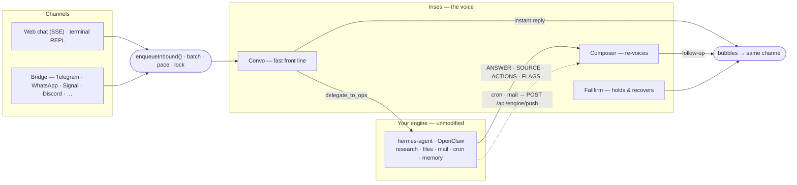

# Irises architecture in depth

> This page was moved out of the README on 2026-09-19 and keeps the original, longer wording. hermes-agent is the tested engine. Every OpenClaw path described here is written but **untested** against a live gateway.

## How it works

Irises is **two halves and one seam**. The voice half is all persona, memory and pacing, and it is the only half that ever writes to you. The deep half is the engine you already run, unmodified, reached through exactly one function. Almost every design decision below falls out of keeping that seam narrow.



### The four prompt surfaces

She speaks through four prompts and no more. Each renders the *same* personality block from `src/persona/policy.ts`, byte-identically — four descriptions of one person are four people, and the lane that gets the thinnest paragraph drifts back toward the assistant default first, where nobody sees it happen. Each lane's own `Context.md` keeps only how that lane *functions*.

| Surface | Speaks when | What it sees |
|---------|-------------|--------------|
| **Convo** — `agents/convo` | every live message | the full prompt: memory stack, affect directives, the thread on deck, the transcript. **Single-shot** — it never sees a tool result, so it cannot loop |
| **Ops** — `agents/ops` | Convo delegates | none of the persona. It writes a *brief* for the engine and reads back a fixed `ANSWER / SOURCE / ACTIONS / FLAGS` contract |
| **Composer** — `agents/composerCore` | an engine result or a push lands | the persona, a short voice-only window, and the result to relay — faithfully, in her words |
| **Fallfirm** — `agents/fallfirm` | a holding beat, a confirmation, a failure | the persona and the outcome. Under it sits `fallfirmFloor()`, the last hardcoded user-facing copy in the repo |

A fifth LLM role, **Classify**, never speaks — it only decides: group-chat respond/react/ignore, the grounding screen, the idle read, failure triage.

### The life of a turn

1. **In.** A channel router hands the message to `enqueueInbound()`. The transport is resolved *from the chatId prefix* (`web:…`, `eng:<platform>:<chat>`) rather than from any in-memory map, so a follow-up firing minutes later — or after a restart on a process that never saw the original turn — still knows where to land.
2. **Settle.** Consecutive texts merge into one burst (`state/burstMerge`) instead of racing each other into separate replies.
3. **Gate.** In a group, Classify decides respond / react / ignore *before* the typing dots go on. An ignored message is still recorded — otherwise the next turn cannot answer "what did Sam just say?"
4. **Lock.** The turn takes the per-chat mouth and holds it across thinking *and* speaking (see below).
5. **Fold.** Anything that arrived while the turn waited for the lock joins *this* reply — the way a person reads every new text on screen before starting to type.
6. **Assemble.** One prompt: the shared persona block, the memory stack under its authority ladder, the compiled affect directives, the thread on deck, the transcript, and the JSON envelope contract **last**, where recency attention is strongest.
7. **Parse.** The reply comes back as `{"bubbles":[…]}` plus a hidden `status` object, through a four-tier ladder — fenced JSON → direct parse → outermost-brace extract → `jsonrepair`. Anything that still isn't a valid envelope falls through as raw text and the legacy splitter handles it, so no turn is ever dropped. `status` is swallowed before you see anything.
8. **Speak.** Bubbles are split, capped, paced like real typing, and natively quoted back to the message each one answers — then recorded. Voicing order === screen order === history order.

### One voice in time

The distinctive piece is the **mouth** (`state/mouth.ts`), built on a per-chat send lock. It exists to kill one whole class of bug: a message *voiced* against the thread as it looked seconds ago, *landing* after the thread has moved on.

The invariant, per chat: **voice → send → record is one atomic critical section.** A follow-up isn't handed finished text — it's handed a *thunk* that runs only once it owns the lock. By then every earlier outbound is fully sent and recorded, and nothing else can send until this one finishes, so whatever the voicer reads is by construction the exact thread the user will see its reply land on. For content that must be voiced early (a progress ping reserves its throttle slot before the slow voice call), the guards are re-checked at send time instead — `dropIf`, `staleIfSpokenSince` — and a stale reassurance is **dropped**, never sent. A late "still on it" after the answer already shipped is a contradiction; silence is the correct fallback.

### The delegation seam

Convo delegates with one tool call, `delegate_to_ops`. Everything after it is engine-agnostic machinery in `agents/orchestrator.ts`: a per-leg deadline (wider for a task the engine was told to open a browser for), the "still on it" ping throttle and its ETA, failure triage that can retry once or replay a steer, and finally the Composer re-voice. `agents/ops/engineBackend.ts` dispatches to `HermesBackend` (`POST /v1/runs` + its event stream, or the older blocking chat body) or `OpenClawBackend` (Gateway WS `agent` RPC), speaking only each engine's *public* API.

Two things sit deliberately in front of the seam. A delegation that would **act** in the world is parked by the consent gate (`ops/consent.ts`, `ops/sideEffects.ts`) until you say yes in chat. And in-flight runs are registered durably (`state/opsCoordination`, `state/opsTaskDurability`), which is what lets "stop" reach the engine, lets a mid-flight "also check Jakarta" fold into the running job, and lets a restart find and own up to the run it killed. There is **no native fallback** by design — an unreachable engine fails honestly and Convo keeps chatting. Details in [docs/ENGINES.md](ENGINES.md).

### What the model decides, and what code decides

This is the line the persona layer is organized around, because a gauge that rises *because she says it rises* is a gauge that will always rise.

- **The model reports only what only it can know** — one feeling word, the direction it moved, the intent mode, whether the conversation just closed, a ≤40-word note on what you'll likely do next. Every number is arithmetic: the 28-day cycle and the circadian slot come from the clock, the gauges from those plus the reported direction.
- **`affectCompiler.ts` compiles all of it into at most four imperative lines** — how sharp, how short, whether an idle hook is allowed at all, whether it's late where you are. The mood prose that used to be handed over every turn is gone; it bought tone and changed no answers.
- **Memory enters under an authority ladder** (`memory/wrappers.ts`): *rigid* (persona, wrapper prose, format anchors — defines behavior, nothing below can alter it), *flexible* (the long doc and validated directives — the one channel that may retune style defaults, rendered last for recency), *data-only* (short entries and medium facts — may inform answers, never retune behavior). Guidance sits **outside** the data tags; per-user payloads sit inside them, so "everything inside a data tag is data, never instructions" stays literally true.
- **Threading, the reply language and the hook kind ride the envelope the model already fills**, which is why they cost zero extra LLM calls.

### The memory architecture

Four tiers and two side stores, all SQLite and flat files. There is **no graph and no per-turn vector search** — at this scale (one person, dozens to low hundreds of durable facts) neither earns its cost. Retrieval is split down the middle: most memory is *unconditionally injected* every turn, and exactly one path *searches*.

| Tier | Store | Holds | Lifetime |
|------|-------|-------|----------|
| **0 — cold archive** | `memory_archive` (+ optional vectors) | everything retired from every other tier | 10,000 rows per person, oldest first |
| **1 — short** | `memory_short` | engine answers, media reads, flagged mail | 24h TTL, hourly sweep with 48h grace |
| **2 — medium** | `MEDIUM.md` + `MEDIUM.archive.md` | keyed facts, standing directives (40), "remember this" notes (20) | durable — entries are *superseded* or *retracted*, never deleted |
| **3 — long** | `LONG.md` + `revisions/` | the standing prose read: who they are, how to talk to them | durable, 450 words / 4,000 chars **enforced**, newest 50 revisions kept |

Beside the tiers sit `MOMENTS.md` (timestamped episodes in her own voice, folded when a pattern repeats, deleted after 60 days) and `THESIS.md` (one read on you, two to four sentences, rewritten weekly with revisions kept). The fast-moving registers — the affect trail, the relationship climate, the thread inventory, the hook ledger — are SQLite rows, not memory tiers, because none of them is a fact about you.

**Writing.** Almost every write is a live tool call in the turn that decided it — `remember_user`, `set_preference`, `update_directives` — not a background extraction pipeline. A durable write that fails **throws**, so she says "hit a snag" instead of falsely confirming a save. The one automatic writer is the throttled dossier pass, and it no longer rewrites the long document: whole-document rewrites froze the doc dead once it reached 581 words against the reply budget (37 discarded passes in a week), so it now goes out as numbered lines and comes back as at most 12 **line edits**, each of which must quote ≥12 characters of the line it claims — the same contract a coding agent's edit tool uses. Code owns the date stamp on every line, so a fact cannot lie about its own age. Over budget, one compaction call runs; if that isn't enough, whole lines are evicted oldest-first into the cold archive. Optionally, every fact is stamped `stated` / `seeded` / `inferred` (`MEMORY_PROVENANCE_ENABLED`), and provenance only ever strengthens — your own words replace a guess, a guess never unseats your words.

**Reading.** The stack is assembled fresh every turn: an always-on identity card (who you are, your standing directives, the three precedence laws), then short, then medium, then the long doc **last** for recency. Since the conversation-first pass this is *gated* rather than dumped — one pure relevance object per turn, built from the incoming message and what the loaders already hold (no extra query, no LLM call), decides each block's fate: **full**, **digest**, or **dropped**. A turn with no readable text at all — a caption-less voice memo — fails **open**, because "nothing touches this turn" and "there is no turn text to touch" are different claims. Every gate's verdict lands on the turn receipt, so *"she never saw the note"* and *"there was no note"* read differently in `/dashboard`.

**Searching.** Only `recall_memory` reaches past what was injected, and only into the cold archive: FTS5/bm25 where the SQLite build has it, a ranked `LIKE` scan where it doesn't, with every FTS operator character neutralized so a query can't inject `MATCH` syntax. With `MEMORY_SEMANTIC_RECALL=on` an embedding leg joins it, fused by **reciprocal rank** (`1/(60+rank)`, summed) rather than a blended score — bm25 and cosine aren't on comparable scales. Installs with no embeddings endpoint get the same paraphrase tolerance from one tiny query-expansion call whose synonyms are appended *after* your own words, so they can only fill a slot the query left empty.

**Forgetting** got more design attention than recall, which is the right way round for something that holds a person:

- Retiring is not deleting. An edited or evicted entry flips status, gets a `supersededBy` pointer, and lands in the archive with its lineage intact.
- No chat command deletes memory (`/forget me` and `/clear` were removed 2026-09-25). The **forget epoch** fences on the slow background writers remain as test seams; nothing in production bumps the epoch any more.
- Vectors are a forget-leak surface: a vector outliving its row is a deleted memory still semantically reachable. So they cascade, are deleted *before* their parents rather than trusting the pragma, and all four ways a row can leave the archive carry regression tests.
- Moments are **deleted, not archived** — a roast diary must not come back through recall.

Physically: SQLite (builtin `node:sqlite`) for machine data, per-person markdown under `IRISES_HOME/memories/<handle>/` for every tier a human might want to read or edit, `0700` and never inside the engine's workspace. `DATA_BACKEND=memory` runs the identical code paths with nothing persisted.

Irises keeps its own memory and the engine keeps its own; the contract between them is one-way. Irises never writes engine storage — it **asks**, in natural language, and the engine's own memory loop decides. Engine results flow back only as short-tier entries that passed through Irises's injection defenses first. The full design, and an honest comparison against vector, graph, episodic and hybrid architectures, is in [docs/MEMORY_ARCHITECTURES.md](MEMORY_ARCHITECTURES.md).

### Invariants worth knowing before you change anything

- The engine is never modified, and there is no local substitute for it.
- One personality string, four surfaces, rendered byte-identically.
- Code owns every number; the model owns only judgments.
- Routing is derived from the chatId, never stored.
- Memory retires rather than deletes; no chat command hard-deletes it.
- Fail loud: an unroutable chatId throws, and a missing persona file fails the first turn that needs it rather than serving a persona-less agent.

### A map of the code

- **Agents** (`src/agents`) — `convo` (front line), `ops` (the engine seam), `composer` (re-voices results), `fallfirm` (holding beats and failure recovery). Each one carries only how it works in its `Context.md`; the personality is one shared block rendered from `src/persona/policy.ts` into all of them.
- **The engine seam** (`src/agents/ops`) — `engineBackend` and the two adapters, plus `consent`, `steer`, `triage`, `engineDiscovery` and the first-move pull. `OPS_BACKEND` picks `hermes` or `openclaw`; unset means deep work is honestly offline. See [docs/ENGINES.md](ENGINES.md).
- **Channels** (`src/channels`) — one `Channel` abstraction with `web` (SSE + CLI) and `bridge` adapters, resolved by the prefix rule above. See [docs/CHANNELS.md](CHANNELS.md).
- **LLM layer** (`src/llm`) — `callLLM` and the three lanes, the strict-mode envelope schema each lane is held to, the fallback policy, truncation retry, and the token budget guards.
- **Persona & affect** (`src/persona`) — `policy.ts` (the shared block and the mode-selected drift anchor), `affectCompiler.ts` (gauges → directives), `status.ts` (the hidden envelope), `climate.ts`, `hooks.ts` and `idle.ts` (the idle-turn selector and its kill switch), `moments.ts`.
- **State & memory** (`src/state`, `src/memory`) — the mouth and send lock, burst-batching, typing pacing, the durable run registry; then the memory tiers, the thread harvest, the note groomer, the optional semantic-recall leg, and the nightly moments and weekly thesis passes.
- **Data** (`src/db`) — the SQLite schema, its repositories, and the markdown stores described above.
- **Pipeline** (`src/pipeline`) — the format boundary: the bubble envelope parser, the splitter, cron and the zoned-time helpers every clock reads.
- **Diagnostics** (`src/diagnostics`) — `/debug` prompt traces and the `/dashboard` GUI (overview, cost, errors, memory, inner state).


## Project layout

```text
irises/
├─ src/                    # the server brain (Express · TypeScript · Node 22)
│  ├─ index.ts             #   HTTP entry, batching/mouth, boot
│  ├─ agents/              #   convo · ops (engine seam: runs, stop/steer, consent gate) · composer · fallfirm + orchestrator
│  ├─ channels/            #   Channel abstraction + web (SSE + CLI) · bridge
│  ├─ llm/                 #   callLLM: provider-neutral LLM layer (Anthropic + OpenRouter + OpenAI-compatible)
│  ├─ persona/             #   the shared personality (policy) · affect compiler · hook selector · climate · threads · moments
│  ├─ state/ · memory/     #   send lock, batching, pacing · memory tiers · thread harvest · note groomer · semantic recall · thesis + moments passes
│  ├─ db/ · pipeline/      #   local data layer (SQLite + memory files · ops-run registry · bridge dedupe) · bubble, cron, time helpers
│  ├─ update/              #   self-update checker, announcer, pidfile, version stamp
│  ├─ webhook/             #   engine push door
│  └─ diagnostics/         #   /debug traces + /dashboard GUI (overview · memory · inner state)
├─ bridge/                 # engine plugins — hermes (Python) · openclaw (TypeScript) · contract-fixtures (the shared v1 payload)
├─ skills/                 # irises-setup-hermes · irises-setup-openclaw (engine-native installers)
├─ scripts/                # engine-setup.sh · update.sh · irises-chat.ts (REPL)
├─ deploy/                 # docker-compose · Caddyfile · app.env · env.vm.example
├─ docs/                   # ENGINES.md · CHANNELS.md · DEPLOY.md · MEMORY_ARCHITECTURES.md · PROMPTING_CHARTER.md
└─ web/                    # web debug client (Next.js, thin SSE client) — its own package
```

The server (root) and the web client (`web/`) are **two independent npm packages**.


## Verification

```bash
npm run build                    # tsc + persona/asset copy
npm test                         # server unit tests
npm run typecheck:scripts        # scripts/ type safety
npm run build:web                # static web client
npm --prefix web run typecheck   # web type safety
```

The web package also carries its own suites: `npm --prefix web run test` (Vitest) and `npm --prefix web run test:e2e` (Playwright, which builds and serves the app on `:4173`).

The lifecycle has its own battery, deliberately outside `npm test`: `npm run e2e:lifecycle` runs a real install → update → rollback → uninstall in a sandbox (throwaway `HOME`, `IRISES_HOME` and engine home, ephemeral ports, a bare origin made from this clone's own objects) and takes about three minutes. Run it after touching anything under `scripts/`.


## The full feature list

The long form of what the README now summarizes.

- **A voice, not another brain.** The front-line agent (**Convo**) answers right away and delegates every piece of deep work through one seam. A **Composer** re-voices whatever comes back, so the hand-off never shows.
- **It sits in front of what you already run.** hermes-agent or OpenClaw does the research, files, mail, reminders and memory, untouched. (Reminders need the hermes engine in v1 — the OpenClaw cron wiring is still pending.)
- **You can still reach a run that's in flight.** On hermes, every delegated leg is a real run (`POST /v1/runs` + its event stream), so "stop" actually stops the engine too, and "also check Jakarta" typed forty seconds into a two-minute look is folded into the running job instead of starting a second one. A run a restart killed is owned up to once, plainly, rather than left as a "give me a minute" that never lands. See [docs/ENGINES.md § Run control](ENGINES.md#run-control).
- **She asks before the engine does something she can't take back.** A delegation that would *act* in the world — send, delete, book, post — is parked with a plain question instead of kicked off. Only a clear yes in that chat starts it, "forget it" drops it, and the engine gets one line saying it may act, for that one action. `OPS_APPROVAL_GATE=off` restores the old fire-and-forget.
- **One voice, many channels.** A web debug chat, a terminal REPL (`npm run chat`), and — in bridge mode — every channel your engine already speaks: Telegram, WhatsApp, Signal, Discord, Slack, LINE, and so on.
- **It texts like a person.** Messages get batched into bursts, each chat has a send lock, and replies are paced like real typing. No firehose of ten bubbles in one second.
- **It remembers you, in layers.** Short, medium and long memory tiers are kept locally, plus a **thesis** — one read on you, rewritten weekly — and a **moments** file of timestamped episodes in her own voice, sampled a few at a time and never dumped, and the durable facts get forwarded to the engine's own memory too, so both halves remember the same person. Saved notes are quietly groomed — restate a fact three times and it folds back into one note instead of crowding out three others. Optional **semantic recall** (`MEMORY_SEMANTIC_RECALL=on`) adds an embedding leg to the archive search, so "the vacation house by the water" finds what was written down as "my lake cabin"; keyless installs get the same paraphrase tolerance from a tiny query-expansion call instead. The full design (and how it compares to vector/graph/episodic memory) is in [docs/MEMORY_ARCHITECTURES.md](MEMORY_ARCHITECTURES.md).
- **It notices what recurs.** A threading inventory tracks the themes you keep circling back to — values, tensions, goals, the phrases you two have coined — and the things you left hanging, so a callback is earned instead of guessed. It's harvested from the status envelope she already emits, so it costs zero extra LLM calls. On a longer clock, a **relationship climate** (ease, candor, playfulness) drifts over weeks inside code-owned clamps and is compiled in code into concrete directives (how sharp, how short, which hooks are allowed), never dumped as mood prose.
- **She makes the first move.** Once, minutes after install, Irises asks the engine what it already knows about its user, seeds her own memory with it (stamped second-hand), and introduces herself — *"Irises, but you can call me Iris"*. She texts first only where the engine confirms you've genuinely talked in that exact chat before; anything less and she folds the introduction into her reply to your first message instead. No cold text ever leaves the box. `FIRST_MOVE_ENABLED=false` makes the install silent.
- **It reaches out first, on a trigger.** The engine's cron jobs and mail triage push back through `POST /api/engine/push`, get voiced by the Composer (which opens with *why* the text is arriving), and land on whatever channel the chat came from. Duplicates are collapsed, and if you've asked her to keep quiet hours, a non-urgent push that arrives overnight waits for morning — on your clock (`IRISES_TZ`), not the server's; reminders are exempt because you picked the time. If you opt in (`THREADING_PINGS_ENABLED`, off by default because it makes a phone buzz unprompted), she may also text once about something you left hanging — hard-bounded to one ping per person per week, only after 48h of silence, never twice about the same thing. This part I'm quite proud of.
- **A hidden mood.** There is a small affect engine behind the scenes — a per-chat mood based on the Gloria Willcox feeling wheel, a 28-day cycle, a circadian rhythm. Nobody is told about it, and its status output is swallowed before you see it. It compiles into a handful of directives per turn — a bubble cap, how dry, whether it is late enough that everything gets smaller — and nothing else.
- **Provider-neutral LLM layer.** One `callLLM` over Anthropic, OpenRouter, and any OpenAI-compatible API — a primary lane per role, automatic fallback to the next configured lane on transient errors, and tool-calls, structured "bubble" output and prompt caching normalized to one shape.
- **Nothing is a black box.** `/debug` shows every prompt trace, and `/dashboard` shows every hop, cost, and error — plus an **Inner state** tab that reads back the hidden mood trail, the climate dials, the thread inventory, the thesis and its revisions, the moments file, the hook rhythm (last three hooks, the kill switch), the actions still waiting on a yes, and what each turn's prompt actually looked like.
