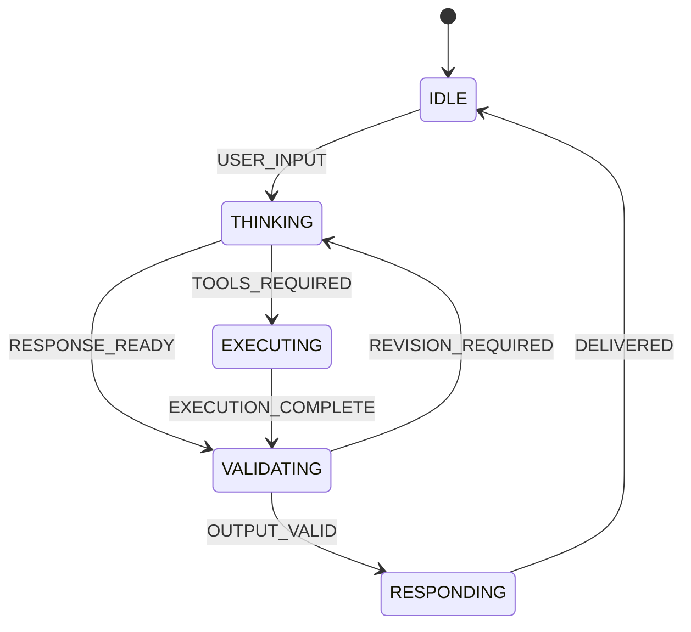
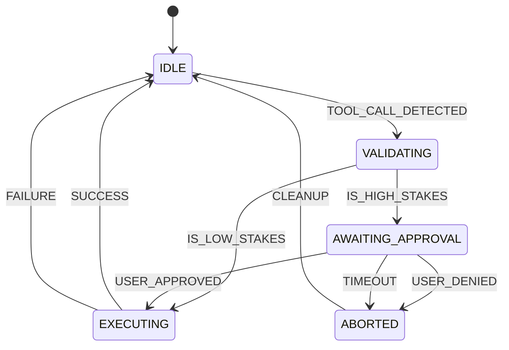

# Irises Architecture Blueprint

This document consolidates the complete architecture and implementation plan for
Irises: a mobile-first, culturally nuanced, multi-agent assistant.

## 1. Architectural System Overview

Irises is a decoupled, event-driven bridge between consumer messaging clients and
an LLM reasoning core. It supports direct responses, specialized agents, and
parallel DAG execution while keeping external mutations behind explicit
confirmation.

### 1.1 System Pipeline

```text
[ USER CLIENT ] <--- WebSocket / Webhook ---> [ GATEWAY LAYER ]
                                                    |
          __________________________________________|__________________________________________
         |                                          |                                          |
 [ WEBHOOK HANDLERS ]                      [ LLM MIDDLEWARE ]                        [ SERVICE ADAPTERS ]
 - Auth & Validation                       - Token Tracking                          - Gmail/Outlook
 - Deduplication                           - Prompt Templating                       - GitHub/Notion
 - Metadata Injection                      - Semantic Routing                        - Calendar/Maps
         |                                          |                                          |
         |__________________________________________|__________________________________________|
                                                    |
                                       [ ORCHESTRATION ENGINE ]
                                       - Agent Arbitration
                                       - DAG Task Execution
                                       - Shared Filesystem
                                       - Worker Pool Management
                                                    |
                                       [ COGNITIVE LAYER ]
                                       - Priority Context Queue
                                       - Vector Long-term Memory
                                       - Linguistic Adapter
```

### 1.2 Component Responsibilities

- **Gateway Layer**: Handles rate limiting, authentication, protocol
  translation (for example, WhatsApp or iMessage to internal JSON), and
  messaging-provider metadata.
- **Coordinator Agent**: Decomposes user requests into tasks and maintains the
  global execution state. The behavioral archetype may be named **Caleb** in
  persona-facing specifications, but it remains the same orchestration role.
- **Worker Agents**: Specialized research, analysis, writing, and action agents
  that execute individual tasks.
- **Orchestration Engine**: Schedules task dependencies, parallel work, shared
  state, and conflict resolution.
- **Cognitive Layer**: Assembles relevant memory and applies the configured
  persona to user-facing output.
- **Conversation Engine**: Converts adapted output into interface-specific
  messages and native UI payloads without changing factual content.
- **Service Adapters**: Wrap external tools and providers behind a common
  interception boundary.
- **LLM Pool and Tool/MCP Hub**: Keep model routing separate from sandboxed tool
  execution so either layer can fail over independently.

### 1.3 Two-Pass Webhook Filtering

Incoming webhook events pass through two filters before orchestration:

1. **Transport Filter**: Authenticate the source, validate the envelope,
   deduplicate delivery IDs, reject malformed events, and normalize provider
   metadata.
2. **Intent Filter**: Classify the normalized event, discard unsupported or
   irrelevant updates, attach routing metadata, and forward actionable events
   to the coordinator.

The transport filter must remain deterministic and inexpensive. Semantic or
model-assisted classification belongs only in the intent filter, after
authentication and deduplication have succeeded.

### 1.4 Turn Lifecycle

The conversation lifecycle is separate from the high-stakes confirmation FSM.
It tracks the active turn from input through delivery:



- **IDLE**: Wait for user input.
- **THINKING**: Parse intent, select an execution mode, and identify tools.
- **EXECUTING**: Run approved tools or generate requested artifacts.
- **VALIDATING**: Check factual output, action state, safety requirements, and
  persona/style rules.
- **RESPONDING**: Deliver the final bubbles or native UI payloads.

If a high-stakes tool is detected during `EXECUTING`, the confirmation FSM takes
control until the action is approved, denied, or timed out. The turn lifecycle
resumes only after that sub-state resolves.

### 1.5 State Signaling Contract

Lifecycle state is internal transport metadata, not user-facing persona text.
Use a structured metadata field when the model/provider API supports one. For
text-only compatibility, an internal model payload must begin with:

```xml
<state>STATE_NAME</state>
```

`STATE_NAME` must be one of `IDLE`, `THINKING`, `EXECUTING`, `VALIDATING`, or
`RESPONDING`.

- Parse the envelope with an XML parser and validate the value against the enum.
- Strip the state element before the Linguistic Adapter and Conversation Engine
  create user-visible bubbles or native UI payloads.
- Treat a missing or invalid state as a protocol error for internal lifecycle
  messages; do not display the malformed envelope to the user.
- Use `THINKING`, `EXECUTING`, and `VALIDATING` for interim lifecycle events.
- A final generated answer carries `RESPONDING`; the orchestrator records
  `IDLE` after delivery rather than asking the final answer to claim it is idle.

## 2. Dynamic Agent-Arbitration Engine

The arbitration engine selects the least expensive execution mode that can
reliably complete a request.

- **Direct Mode**: Handles simple conversation and intent classification.
- **Single-Agent Mode**: Handles requests requiring one tool or one specialized
  capability.
- **Multi-Agent DAG Mode**: Handles requests with multiple tools, parallel
  branches, or dependent subtasks.

A fast classifier calculates a complexity score from the request, required
tools, and active context. The exact thresholds must be calibrated with latency,
cost, and completion-rate benchmarks rather than treated as permanent values.
The initial proposal used a logit-bias check or GPT-4o-mini to assign a 1-10
complexity score and sent scores above 3 to sub-agents. Retain those values as a
benchmarking baseline, not a permanent production rule.

```typescript
async function arbitrate(
  request: UserRequest,
  context: Context,
): Promise<ExecutionPlan> {
  const intent = await IntentClassifier.predict(request.text);
  const complexity = ScoringModel.calculate(request, context);

  if (complexity < THRESHOLD_LOW && intent.isConversational) {
    return { type: 'DIRECT', model: 'fast-model-small' };
  }

  if (complexity < THRESHOLD_HIGH && intent.requiredTools.length === 1) {
    return { type: 'SINGLE_AGENT', agentId: intent.requiredTools[0] };
  }

  return {
    type: 'MULTI_AGENT_DAG',
    dag: await DAGGenerator.build(intent, context),
  };
}
```

## 3. Multi-Agent Orchestration Protocol

Irises uses a directed acyclic graph so independent task branches can run in
parallel while dependent tasks wait for their prerequisites.

### 3.1 Core Interfaces

```typescript
interface TaskNode {
  id: string;
  agentId: string;
  action: string;
  priority: number;
  input: Record<string, unknown>;
  dependencies: string[];
  status: 'PENDING' | 'RUNNING' | 'COMPLETED' | 'FAILED';
  output?: unknown;
}

interface TaskDAG {
  id: string;
  nodes: TaskNode[];
  sharedFsPath: string;
}

interface AgentExecutor {
  agentId: string;
  role: 'RESEARCHER' | 'COORDINATOR' | 'WRITER' | 'EXECUTOR';
  capabilities: string[];
  execute(node: TaskNode, fs: FileSystemStore): Promise<void>;
}

interface WorkerPool {
  size: number;
  activeWorkers: Map<string, AgentExecutor>;
  schedule(node: TaskNode): Promise<void>;
}

interface FileSystemStore {
  read(path: string): Promise<string>;
  write(path: string, content: string): Promise<void>;
  list(directory: string): Promise<string[]>;
  lock(path: string): Promise<boolean>;
  unlock(path: string): void;
}
```

### 3.2 Execution Pipeline

1. Parse the user request into an execution plan.
2. Push DAG nodes with no unresolved dependencies to the worker pool.
3. Isolate task-specific memory while exposing approved artifacts through the
   shared filesystem.
4. Record each result and release newly unblocked nodes.
5. Stop or recover when a task fails, depending on the task policy.
6. Return completed outputs to the coordinator for synthesis.

### 3.3 Shared Filesystem and Conflict Resolution

- Use a persistent task workspace for intermediate artifacts instead of passing
  large strings through every agent context. Earlier proposals used
  `/workspace/user/` or `/workspace/` as the persistent mount.
- Write through `.tmp` files followed by atomic renames.
- Lock individual paths during conflicting operations. The initial distributed
  design used a Redis-backed lock manager.
- Use last-write-wins for replaceable metadata and versioned copies or vector
  clocks for text that must be merged.
- Limit recursive tool or sub-agent depth to prevent runaway loops. The initial
  maximum depth was `N=5`.

For example, one agent can write `/tmp/task_1.md` while a dependent agent reads
it to draft an email. If another agent needs to write the same path, it waits
for the lock or writes a versioned copy.

Earlier interface drafts represented DAG nodes as either `TaskNode[]` or
`Map<string, TaskNode>`. Choose one representation during implementation and
keep it consistent across the scheduler and persistence layer.

## 4. Guardrails and Confirmation Engine

Every external tool call passes through a single interception layer before
execution.

### 4.1 Action Classification

| Category | Examples | Policy |
| :--- | :--- | :--- |
| Lightweight | Read-only search, reading email, local reminders, calendar blocks | Execute autonomously |
| High-stakes | Sending email, deleting files, modifying shared documents, GitHub pushes, payments | Require explicit confirmation |

External write operations default to high-stakes. An earlier conservative
proposal intercepted every write as `PENDING_APPROVAL`; any narrower policy must
be explicit in tool metadata rather than inferred at runtime.

For lightweight actions, use smart defaults instead of repeatedly asking the
user for low-impact preferences. A smart default must be reversible,
deterministic, visible in the result, and must never cross into a high-stakes
mutation or override an explicit user preference.

### 4.2 Confirmation State Machine



| Current State | Event | Action | Next State |
| :--- | :--- | :--- | :--- |
| `IDLE` | `TOOL_CALL_DETECTED` | Check the tool sensitivity level | `VALIDATING` |
| `VALIDATING` | `IS_LOW_STAKES` | Execute immediately | `EXECUTING` |
| `VALIDATING` | `IS_HIGH_STAKES` | Intercept, generate preview, and prompt the user | `AWAITING_APPROVAL` |
| `AWAITING_APPROVAL` | `USER_APPROVED` | Dispatch the saved tool call | `EXECUTING` |
| `AWAITING_APPROVAL` | `USER_DENIED` | Notify the user and clean up pending state | `ABORTED` |
| `AWAITING_APPROVAL` | `TIMEOUT` | Auto-abort, notify, and clean up pending state | `ABORTED` |
| `ABORTED` | `CLEANUP` | Remove the pending action | `IDLE` |
| `EXECUTING` | Success | Return result to orchestrator | `IDLE` |
| `EXECUTING` | Failure | Start configured recovery or fallback | `IDLE` |

### 4.3 Programmatic Interception

```typescript
async function interceptTool(call: ToolCall): Promise<InterceptionResult> {
  const preview = await getPreviewSchema(call);

  if (isHighStakes(call)) {
    return {
      status: 'PAUSE',
      preview,
      signal: 'USER_CONFIRM_NEEDED',
    };
  }

  return { status: 'PROCEED' };
}
```

The pending action must store the exact reviewed payload. Approval dispatches
that payload rather than regenerating it after the user confirms.

The interception boundary was originally named `ToolProxy`. A tool declaring
`tool.metadata.highStakes === true` caused the proxy to raise
`ConfirmationRequired`, which opened the preview loop. The UI receives a JSON
payload for Preview, Edit, Confirm, and Cancel controls.

Earlier state names `INTERCEPTED` and `PREVIEW` map to the validation and preview
work performed before `AWAITING_APPROVAL`. They may be implemented as explicit
states if the UI needs to persist or observe those phases.

## 5. Cognitive Memory and Token Management

Irises replaces rolling journal memory with prioritized context assembly.

### 5.1 Memory Hierarchy

1. **Current Turn**: The active message, system instructions, and current tool
   outputs.
2. **Session Memory**: Recent exchanges and active task state.
3. **Mid-term Context**: Topic summaries and inactive task-branch summaries.
4. **Long-term Semantic Memory**: Relevant user preferences, facts, documents,
   and historical records retrieved through vector search.
5. **Narrative Compression**: High-level summaries of long-running projects,
   recurring collaboration patterns, and relationship context. Narrative
   summaries must link back to source memory nodes and must not replace precise
   facts such as identifiers, dates, or commit hashes.

The active intent adjusts retrieval weights. A direct reference favors the
current turn; a historical question increases the weight of long-term memory.

Initial tuning values from the earlier designs:

- Keep the last 3-5 exchanges for immediate conversational flow, with a broader
  5-10 turn session window where the token budget permits.
- Weight current-turn context at 100%, the last 10 messages at 80%, and the top
  five semantic results at 40%.
- For a direct reference, start with `turn_weight=0.9` and
  `mid_term=0.1`.
- For a historical query, start with `turn_weight=0.2` and
  `long_term=0.8`.

### 5.2 Token Pruning

- Reserve the largest share of the context budget for the current turn.
- Truncate low-relevance semantic results first.
- Summarize older session turns before dropping them.
- Convert important facts from discarded turns into memory nodes.
- Distill inactive task branches into concise result summaries.

The earlier pruning triggers were 70% context utilization and an absolute
120,000-token context size. Treat both as initial test cases: truncate Tier 3
first, then summarize Tier 2, while protecting the current turn.

### 5.3 Storage Schema

```sql
CREATE TABLE session_cache (
    session_id UUID PRIMARY KEY,
    recent_messages JSONB,
    active_tokens INT
);

CREATE TABLE mid_term_context (
    id SERIAL PRIMARY KEY,
    user_id UUID,
    topic VARCHAR(255),
    summary TEXT,
    last_accessed TIMESTAMP,
    relevance_score FLOAT
);

CREATE TABLE semantic_memory (
    id UUID PRIMARY KEY,
    user_id UUID,
    embedding VECTOR(1536),
    content TEXT,
    metadata JSONB
);
```

The `VECTOR(1536)` shape came from the original OpenAI/Ada-002 example. The
production dimension must match the configured embedding model.

```json
{
  "node_id": "uuid",
  "category": "preference",
  "content": "User prefers lowercase in texts",
  "confidence": 0.95,
  "source": "chat_history",
  "last_accessed": "2026-06-07T02:48:00Z",
  "importance": 0.8
}
```

Valid memory categories in the initial schema were `preference`, `fact`, and
`relationship`.

## 6. Linguistic and Persona Adapter

Irises uses a separate persona layer so communication style can evolve without
mixing it into core tool schemas or orchestration instructions. It is middleware
between the language-agnostic Execution Engine and the interface-specific
Conversation Engine:

```text
[ Execution Engine ] -> [ Linguistic Adapter ] -> [ Conversation Engine ]
 raw facts and status      user style vector       bubbles and native UI
```

The adapter may change presentation, but it must not alter facts, action status,
tool results, confirmation requirements, or safety warnings.

### 6.1 Behavioral Rules

- Mirror the user's register.
- Use casual English/Indonesian-Jaksel language naturally.
- Prefer `gw` and `lo` when the user uses that register.
- Use common contractions such as `udh`, `jg`, `blm`, `skrg`, and `tp`.
- Use casual acronyms such as `otw`, `yks`, and `gas` when they fit the user's
  register.
- Use `2` for informal repetition where appropriate, such as `jalan2`.
- Keep user-facing text lowercase except where a proper name or brand requires
  its original casing.
- Avoid assistant boilerplate, moralizing, and unnecessary recaps.
- Be witty and direct without becoming rude.
- Focus on forward motion and the next useful action.
- Prefer bubbles or line breaks over dense commas and complex punctuation when
  structural separation improves mobile readability.
- Translate provider and system failures into concise human language, while
  preserving the error category, correlation identifier when available, and
  the next actionable recovery step. Never mock the user for a system failure.
- Activate a serious support mode for mental-health, relapse, crisis, grief, or
  similarly sensitive topics: suppress sarcasm, slang, quips, and judgment.
  Remain calm and supportive without claiming clinical expertise.

The canonical identity and behavioral modes live in `public/PERSONA.md` and
`public/ARCHETYPE.md`.

The initial normalization examples were:

| Input | Output |
| :--- | :--- |
| `sekarang` | `skrg` |
| `belum` | `blm` |
| `sudah` | `udh` |
| `juga` | `jg` |
| `tapi` | `tp` |
| `gua` / `gue` | `gw` |
| `lu` / `lo` | `lo` |
| `kata-kata` | `kata2` |
| `hati-hati` | `hati2` |

The proposed repetition transform was
`text.replace(/\b(\w+)-\1\b/g, "$12")`, followed by `text.toLowerCase()` for
persona-controlled output.

The original baseline prompt was:

```text
You are Irises, the user's smart, sassy, and slightly cynical bro.
Do not use assistant boilerplate or moralizing lectures.
Never say "As an AI language model."
Mirror the user's register and use Jaksel slang naturally.
Keep user-facing output lowercase and avoid unnecessary recaps.
If a request is misguided, call it out jokingly without blocking forward motion.
```

### 6.2 Style Vector and Drift

The adapter maintains a durable user style profile, then analyzes the user's
last 3-5 messages for temporary style drift. The current-turn style vector may
override presentation choices without rewriting the durable profile.

```typescript
interface StyleVector {
  casing: 'strict_lowercase' | 'sentence_case' | 'all_caps_shouting';
  slangIntensity: 'none' | 'moderate_jaksel' | 'heavy_genz';
  brevity: 'ultra_short' | 'descriptive';
  punctuationMask: Array<
    'strip_trailing_periods' | 'no_em_dashes'
  >;
}
```

- **Casing**: Selects lowercase, standard sentence casing, or intentional
  all-caps emphasis.
- **Slang intensity**: Controls whether linguistic mapping is disabled,
  moderate, or heavy.
- **Brevity**: Selects compact messaging or a more descriptive response.
- **Punctuation mask**: Applies channel-appropriate punctuation constraints.

Urgency signals such as terse commands or all-caps input temporarily prioritize
utility over persona: select compact output, reduce slang, and suppress quips so
the required information or action is delivered immediately.

Sensitive-topic signals override the normal style vector entirely. They select
serious casing, zero slang, clear punctuation, and a supportive tone until the
conversation safely returns to an ordinary context.

### 6.3 Style Arbitration Pipeline

```typescript
class LinguisticAdapter {
  constructor(private readonly userStyleProfile: StyleProfile) {}

  async adapt(
    rawResponse: string,
    context: ConversationContext,
  ): Promise<string[]> {
    const recentMessages = context.recentUserMessages.slice(-5);
    const style = this.analyzeStyleDrift(
      this.userStyleProfile,
      recentMessages,
    );

    let formatted = this.applyCasing(rawResponse, style.casing);
    formatted = this.applyLinguisticMapping(
      formatted,
      style.slangIntensity,
    );
    formatted = this.contractRepetitions(formatted);
    formatted = this.sanitizeFormatting(
      formatted,
      style.punctuationMask,
    );

    return this.splitIntoBubbles(formatted, style.brevity);
  }
}
```

The transformation order is deliberate: casing, slang mapping, repetition
contraction, sanitization, then bubble splitting. Tests must verify that these
operations preserve URLs, code, proper names, numbers, and tool-generated data.

## 7. Mobile Output and Native Rendering

User-facing responses are optimized for short messaging interactions.

### 7.1 Formatting Rules

- Remove trailing periods when the selected persona calls for text-message
  formatting.
- Replace em dashes with commas, simple hyphens, or line breaks.
- Earlier formatting examples also allowed `..` as an informal pause.
- Strip unsupported Markdown while preserving raw links.
- Prefer separate bubbles or line breaks to punctuation-heavy clauses when they
  represent distinct thoughts or actions.
- Split long responses into coherent bubbles, targeting a maximum of 160
  characters for notification-style output.
- Keep real-time progress updates between 30 and 160 characters.
- Put the next action or forward-motion prompt in the final bubble when doing so
  does not change the meaning or ordering of the response.

### 7.2 Bubble Splitting

```typescript
function splitIntoBubbles(text: string): string[] {
  const sentences = text.split(/(?<=[.!?])\s+/);
  const bubbles: string[] = [];
  let current = '';

  for (const sentence of sentences) {
    const next = current ? `${current} ${sentence}` : sentence;

    if (next.length > 160 && current) {
      bubbles.push(clean(current));
      current = sentence;
    } else {
      current = next;
    }
  }

  if (current) bubbles.push(clean(current));
  return bubbles;
}

function clean(text: string): string {
  return text.trim().replace(/\.$/, '').toLowerCase();
}
```

### 7.3 Native UI Payloads

- Map `chrono` time entities and `schema.type: "time-picker"` to native date or
  time pickers, including Apple Messages for Business payloads such as
  `LPLinkMetadata` or Interactive Message payloads where appropriate.
- Render `schema.type: "quick-reply"` as two or three likely follow-up buttons.
  Initial examples were "Gas", "Bentar", and "Cancel".
- Render `schema.type: "list-picker"` for bounded selections such as GitHub
  repositories or files.
- Render high-stakes actions as preview, edit, confirm, and cancel controls.
- Keep provider-specific payloads inside messaging adapters.

## 8. Adaptive Latency and Model Fallback

- Route simple work to a fast, low-cost model.
- Escalate complex tasks to a stronger reasoning model.
- Route code analysis and sandbox execution by required capability and risk,
  not cost alone; use a frontier-capable model when the task exceeds the fast
  model's validated tool-use or reasoning limits.
- Retry transient provider failures through a configured fallback provider.
- Use circuit breakers when a step exceeds its latency budget.
- Preserve task state across retries so completed work is not repeated.

Model names and thresholds belong in runtime configuration because provider
capabilities and pricing change over time.

The initial fallback proposal used GPT-4o-mini for default work, Claude 3.5
Sonnet for complex reasoning, and Anthropic or Azure-hosted instances after
OpenAI 500 responses. It also paused an agent loop when a step exceeded 30
seconds. Preserve these as historical configuration examples to benchmark
against currently available providers.

## 9. Payment and Cost Approval

Before high-cost work:

1. Estimate resource usage and compare it with the user's remaining quota.
2. Present a clear cost estimate and the proposed scope.
3. Store the reviewed task and charge details as a pending action.
4. Start the work only after explicit approval.

Payments and charge approvals are high-stakes actions and use the same
confirmation engine as other external mutations.

The original high-cost example was mass web scraping, presented as a Cost
Estimate bubble with an Approve Charge action.

## 10. Security Architecture

### 10.1 Runtime Hardening

- Do not allow `unsafe-eval` or `unsafe-inline` in the Content Security Policy.
- Move untrusted dynamic execution into an isolated Web Worker or sandbox, such
  as `vm2` or QuickJS compiled to WebAssembly.
- Create a transient sandbox per task. Server-side workers may use a path such
  as `/tmp/sandbox/<task-id>`; browser runtimes use an isolated worker or
  equivalent origin boundary.
- Destroy the transient sandbox after the task and do not carry environment
  variables into later turns unless an approved value is explicitly stored in
  the memory or secrets layer.
- Precompile templates and application logic.
- Use Trusted Types so raw strings cannot reach DOM or execution sinks such as
  `innerHTML` or `eval()`.
- Keep tool schemas and the core system prompt isolated from user-controlled
  persona content.

```http
Content-Security-Policy: default-src 'self'; script-src 'self'; object-src 'none'; style-src 'self';
```

### 10.2 Tool Safety

- Authenticate and authorize every provider request.
- Validate tool inputs against schemas before interception and execution.
- Deduplicate webhook events and mutation requests.
- Record confirmation, execution, and failure events in an audit log.
- Apply execution timeouts and maximum agent depth.

## 11. End-to-End Testing Harness

- **Persona Evaluator**: Scores register matching, brevity, slang accuracy, and
  tone without overriding deterministic formatting tests.
- **Regression Suite**: Covers direct responses, tool use, multi-agent plans,
  and confirmation flows. The initial target was 500 or more golden scenarios.
- **Latency Benchmarks**: Measures arbitration and execution against defined
  service-level targets. The initial target was 2.5 seconds for 90% of requests.
- **Conflict Simulator**: Exercises parallel reads, writes, locks, and merge
  behavior in the shared filesystem.
- **Security Tests**: Verifies CSP headers, schema validation, prompt isolation,
  and rejection of unapproved mutations.
- **Golden Scenarios**: Includes common tasks such as booking research,
  reminders, email drafts, and GitHub actions. Original examples included
  "book a flight to Bali" and "remind me to buy milk."

```bash
npm run test:persona -- --model=gpt-4o-mini --threshold=0.85
```

The architecture is complete only when these tests cover both successful paths
and failures such as rejected approvals, timeouts, provider errors, and
concurrent write conflicts.
